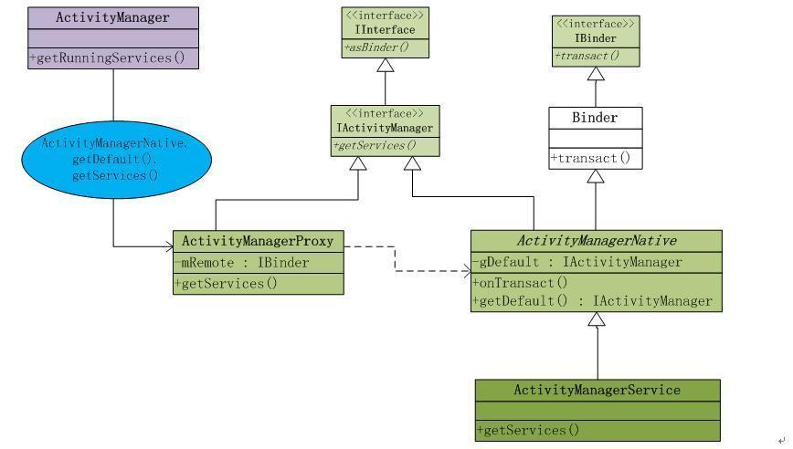

<div align=center>

</div>

https://juejin.im/entry/582d319e0ce463006ce68110

# ActivityManager
`/frameworks/base/core/java/android/app/ActivityManager.java`

ActivityManager是客户端用来管理系统中正在运行的所有Activity包括Task、Memory、Service等信息的工具。但是这些这些信息的维护工作却不是由ActivityManager负责的。在ActivityManager中有大量的get()方法，那么也就说明了他只是提供信息给AMS，由AMS去完成交互和调度工作。

# AMS
`/frameworks/base/services/java/com/android/server/am/ActivityManagerService.java`

AMS是作为管理Android系统组件的核心服务，他在SystemServer执行run()方法的时候被创建，并运行在独立的进程中。具体来说就是SystemServer管理着Android中所有的系统服务，这些系统服务的生命周期回调都由SystemServer去调度负责。

```java
    private void startBootstrapServices() {
        ...
        Installer installer = mSystemServiceManager.startService(Installer.class);

        // Activity manager runs the show.
        mActivityManagerService = mSystemServiceManager.startService(
                ActivityManagerService.Lifecycle.class).getService();
        mActivityManagerService.setSystemServiceManager(mSystemServiceManager);
        mActivityManagerService.setInstaller(installer);
        ...
    }
```

在SystemServer调用run()方法中开启必要的系统服务，并将这些服务注册和添加到管理列表中，并执行这些服务在进程中的生命周期。ActivityManagerService作为一个重要的核心服务就是在这里被初始成功的。

我们知道AMS和ActivityManager之间通信需要利用Binder来完成，那么我们接下来分析一下这个通信机制是如何实现的。
ActivityManagerNative(AMN)中实现的代码是运行在Android应用程序的进程空间内，可直接使用的对象，Intent会由应用程序通过这个类将方法对应的Binder命令发送出去。ActivityManagerNative(AMN)是一个抽象的类，他包含了如下特点：
1. 继承Binder类
2. 实现IActivityManager接口
由于继承了Binder类，他就拥有了远程通信的条件。实现了IActivityManager接口，他能够得到ActivityManager管理关于内存、任务等内部信息。那么AMS作为AMN的子类也就自然享有了这些特性。

我们再回过头来看看ActivityManager中的方法是如何被调用的，举个栗子：
```java
    public List getAppTasks() {
        ArrayList tasks = new ArrayList();
        List appTasks;
        try {
            appTasks = ActivityManagerNative.getDefault().getAppTasks(mContext.getPackageName());
        } catch (RemoteException e) {
            throw e.rethrowFromSystemServer();
        }
        ...
        return tasks;
    }
```

我们在代码中发现，类似的get()方法的调用逻辑都是先通过ActivityManagerNative.getDefault()来获得ActivityManager的代理接口对象。getDefault()到底做了什么？
```java
    /**
     * Retrieve the system's default/global activity manager.
     */
    static public IActivityManager getDefault() {
        return gDefault.get();
    }

    private static final Singleton gDefault = new Singleton() {
        protected IActivityManager create() {
            IBinder b = ServiceManager.getService("activity");
            if (false) {
                Log.v("ActivityManager", "default service binder = " + b);
            }
            IActivityManager am = asInterface(b);
            if (false) {
                Log.v("ActivityManager", "default service = " + am);
            }
            return am;
        }
    };
```

ServiceManager是系统提供的服务管理类，所有的Service都通过他被注册和管理，并且通过getService()方法能够得到ActivityManager与AMS的远程通信Binder对象。

```java
    /**
     * Cast a Binder object into an activity manager interface, generating
     * a proxy if needed.
     */
    static public IActivityManager asInterface(IBinder obj) {
        if (obj == null) {
            return null;
        }
        IActivityManager in =
            (IActivityManager)obj.queryLocalInterface(descriptor);
        if (in != null) {
            return in;
        }

        return new ActivityManagerProxy(obj);
    }
```

得到了AMS的Binder对象之后，也就相当于拿到了与ActivityManager远程通信的许可证。接着，在asInterface()这个方法中，这个许可证的使用权利被移交给了ActivityManagerProxy，那么ActivityManagerProxy就成为了ActivityManager与AMS远程通信的代理。

ActivityManagerProxy也实现了IActivityManager接口。当客户端（ActivityManager）发起向服务端（AMS）的远程请求时，客户端提供的数据参数信息被封装打包，然后由ActivityManager的远程通信binder对象通过transact()方法把数据提交，然后再把数据写出返回给binder对象。
```java
    public int startActivity(IApplicationThread caller, String callingPackage, Intent intent,
            String resolvedType, IBinder resultTo, String resultWho, int requestCode,
            int startFlags, ProfilerInfo profilerInfo, Bundle options) throws RemoteException {
        Parcel data = Parcel.obtain();
        Parcel reply = Parcel.obtain();
        data.writeInterfaceToken(IActivityManager.descriptor);
        data.writeStrongBinder(caller != null ? caller.asBinder() : null);
        data.writeString(callingPackage);
        intent.writeToParcel(data, 0);
        data.writeString(resolvedType);
        data.writeStrongBinder(resultTo);
        data.writeString(resultWho);
        data.writeInt(requestCode);
        data.writeInt(startFlags);
        if (profilerInfo != null) {
            data.writeInt(1);
            profilerInfo.writeToParcel(data, Parcelable.PARCELABLE_WRITE_RETURN_VALUE);
        } else {
            data.writeInt(0);
        }
        if (options != null) {
            data.writeInt(1);
            options.writeToParcel(data, 0);
        } else {
            data.writeInt(0);
        }
        mRemote.transact(START_ACTIVITY_TRANSACTION, data, reply, 0);
        reply.readException();
        int result = reply.readInt();
        reply.recycle();
        data.recycle();
        return result;
    }
```
通过这种方式，AMS在自己的进程中就能获得ActivityManager进程发来的数据信息，从而完成对于Android系统组件生命周期的调度工作。