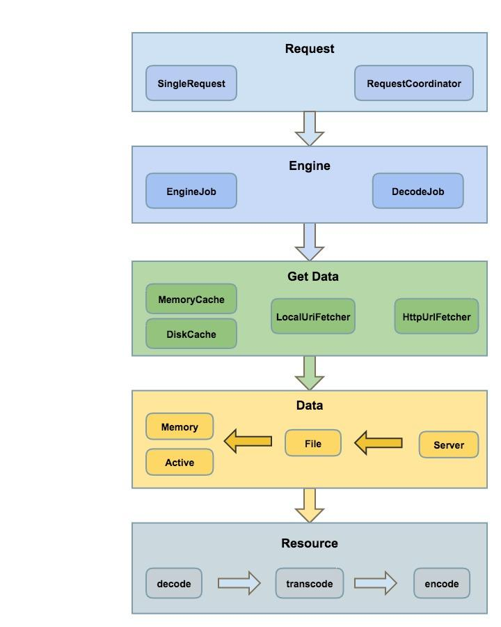
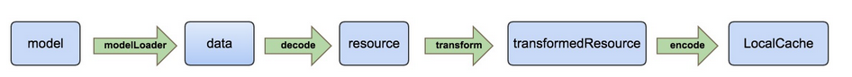

总设计图
<div align=center>

</div>

# Glide.with()
```java
    /**
     * Begin a load with Glide by passing in a context.
     *
     * <p>
     *     Any requests started using a context will only have the application level options applied and will not be
     *     started or stopped based on lifecycle events. In general, loads should be started at the level the result
     *     will be used in. If the resource will be used in a view in a child fragment,
     *     the load should be started with {@link #with(android.app.Fragment)}} using that child fragment. Similarly,
     *     if the resource will be used in a view in the parent fragment, the load should be started with
     *     {@link #with(android.app.Fragment)} using the parent fragment. In the same vein, if the resource will be used
     *     in a view in an activity, the load should be started with {@link #with(android.app.Activity)}}.
     * </p>
     *
     * <p>
     *     This method is appropriate for resources that will be used outside of the normal fragment or activity
     *     lifecycle (For example in services, or for notification thumbnails).
     * </p>
     *
     * @see #with(android.app.Activity)
     * @see #with(android.app.Fragment)
     * @see #with(android.support.v4.app.Fragment)
     * @see #with(android.support.v4.app.FragmentActivity)
     *
     * @param context Any context, will not be retained.
     * @return A RequestManager for the top level application that can be used to start a load.
     */
    public static RequestManager with(Context context) {
        RequestManagerRetriever retriever = RequestManagerRetriever.get();
        return retriever.get(context);
    }

    /**
     * Begin a load with Glide that will be tied to the given {@link android.app.Activity}'s lifecycle and that uses the
     * given {@link Activity}'s default options.
     *
     * @param activity The activity to use.
     * @return A RequestManager for the given activity that can be used to start a load.
     */
    public static RequestManager with(Activity activity) {
        RequestManagerRetriever retriever = RequestManagerRetriever.get();
        return retriever.get(activity);
    }

    /**
     * Begin a load with Glide that will tied to the give {@link android.support.v4.app.FragmentActivity}'s lifecycle
     * and that uses the given {@link android.support.v4.app.FragmentActivity}'s default options.
     *
     * @param activity The activity to use.
     * @return A RequestManager for the given FragmentActivity that can be used to start a load.
     */
    public static RequestManager with(FragmentActivity activity) {
        RequestManagerRetriever retriever = RequestManagerRetriever.get();
        return retriever.get(activity);
    }

    /**
     * Begin a load with Glide that will be tied to the given {@link android.app.Fragment}'s lifecycle and that uses
     * the given {@link android.app.Fragment}'s default options.
     *
     * @param fragment The fragment to use.
     * @return A RequestManager for the given Fragment that can be used to start a load.
     */
    @TargetApi(Build.VERSION_CODES.HONEYCOMB)
    public static RequestManager with(android.app.Fragment fragment) {
        RequestManagerRetriever retriever = RequestManagerRetriever.get();
        return retriever.get(fragment);
    }

    /**
     * Begin a load with Glide that will be tied to the given {@link android.support.v4.app.Fragment}'s lifecycle and
     * that uses the given {@link android.support.v4.app.Fragment}'s default options.
     *
     * @param fragment The fragment to use.
     * @return A RequestManager for the given Fragment that can be used to start a load.
     */
    public static RequestManager with(Fragment fragment) {
        RequestManagerRetriever retriever = RequestManagerRetriever.get();
        return retriever.get(fragment);
    }
```
可以看到有5个重载方法,都创建了一个RequestManagerRetriever实例然后调用了get()方法

```java
    public RequestManager get(Context context) {
        if (context == null) {
            throw new IllegalArgumentException("You cannot start a load on a null Context");
        } else if (Util.isOnMainThread() && !(context instanceof Application)) {
            if (context instanceof FragmentActivity) {
                return get((FragmentActivity) context);
            } else if (context instanceof Activity) {
                return get((Activity) context);
            } else if (context instanceof ContextWrapper) {
                return get(((ContextWrapper) context).getBaseContext());
            }
        }

        return getApplicationManager(context);
    }
```

其实不管到哪个方法最后都会执行getApplicationManager(context)
```java
    private RequestManager getApplicationManager(Context context) {
        // Either an application context or we're on a background thread.
        if (applicationManager == null) {
            synchronized (this) {
                if (applicationManager == null) {
                    // Normally pause/resume is taken care of by the fragment we add to the fragment or activity.
                    // However, in this case since the manager attached to the application will not receive lifecycle
                    // events, we must force the manager to start resumed using ApplicationLifecycle.
                    applicationManager = new RequestManager(context.getApplicationContext(),
                            new ApplicationLifecycle(), new EmptyRequestManagerTreeNode());
                }
            }
        }

        return applicationManager;
    }

    RequestManager(Context context, final Lifecycle lifecycle, RequestManagerTreeNode treeNode,
            RequestTracker requestTracker, ConnectivityMonitorFactory factory) {
        this.context = context.getApplicationContext();
        this.lifecycle = lifecycle;
        this.treeNode = treeNode;
        this.requestTracker = requestTracker;
        this.glide = Glide.get(context);
        this.optionsApplier = new OptionsApplier();

        ConnectivityMonitor connectivityMonitor = factory.build(context,
                new RequestManagerConnectivityListener(requestTracker));

        // If we're the application level request manager, we may be created on a background thread. In that case we
        // cannot risk synchronously pausing or resuming requests, so we hack around the issue by delaying adding
        // ourselves as a lifecycle listener by posting to the main thread. This should be entirely safe.
        if (Util.isOnBackgroundThread()) {
            new Handler(Looper.getMainLooper()).post(new Runnable() {
                @Override
                public void run() {
                    lifecycle.addListener(RequestManager.this);
                }
            });
        } else {
            lifecycle.addListener(this);
        }
        lifecycle.addListener(connectivityMonitor);
    }

    public static Glide get(Context context) {
        if (glide == null) {
            synchronized (Glide.class) {
                if (glide == null) {
                    Context applicationContext = context.getApplicationContext();
                    GlideBuilder builder = new GlideBuilder(applicationContext);
                    List<GlideModule> modules = parseGlideModules(applicationContext);
                    for (GlideModule module : modules) {
                        module.applyOptions(applicationContext, builder);
                    }
                    Glide glide = builder.createGlide();
                    for (GlideModule module : modules) {
                        module.registerComponents(applicationContext, glide);
                    }
                    Glide.glide = glide;
                }
            }
        }

        return glide;
    }
```
先创建了GlideBuilder,然后调用其createGlide创建glide, GlideBuilder为Glide设置一些默认配置，而且可以通过GlideModule进行一些延迟的配置和ModelLoaders的注册。

## Glide.with().load()
```java
    public DrawableTypeRequest<String> load(String string) {
        return (DrawableTypeRequest<String>) fromString().load(string);
    }
```

它们都调用了loadGeneric方法返回DrawableTypeRequest，然后调用DrawableTypeRequest的load()方法：
```java
    private <T> DrawableTypeRequest<T> loadGeneric(Class<T> modelClass) {
        ModelLoader<T, InputStream> streamModelLoader = Glide.buildStreamModelLoader(modelClass, context);
        ModelLoader<T, ParcelFileDescriptor> fileDescriptorModelLoader =
                Glide.buildFileDescriptorModelLoader(modelClass, context);
        if (modelClass != null && streamModelLoader == null && fileDescriptorModelLoader == null) {
            throw new IllegalArgumentException("Unknown type " + modelClass + ". You must provide a Model of a type for"
                    + " which there is a registered ModelLoader, if you are using a custom model, you must first call"
                    + " Glide#register with a ModelLoaderFactory for your custom model class");
        }

        return optionsApplier.apply(
                new DrawableTypeRequest<T>(modelClass, streamModelLoader, fileDescriptorModelLoader, context,
                        glide, requestTracker, lifecycle, optionsApplier));
    }
```
load方法继承自父类GenericRequestBuilder：
```java
    public GenericRequestBuilder<ModelType, DataType, ResourceType, TranscodeType> load(ModelType model) {
        this.model = model;
        isModelSet = true;
        return this;
    }
```

## Glide.with().load().into()
```java
    /**
     * Sets the {@link ImageView} the resource will be loaded into, cancels any existing loads into the view, and frees
     * any resources Glide may have previously loaded into the view so they may be reused.
     *
     * @see Glide#clear(android.view.View)
     *
     * @param view The view to cancel previous loads for and load the new resource into.
     * @return The {@link com.bumptech.glide.request.target.Target} used to wrap the given {@link ImageView}.
     */
    public Target<TranscodeType> into(ImageView view) {
        Util.assertMainThread();
        if (view == null) {
            throw new IllegalArgumentException("You must pass in a non null View");
        }

        if (!isTransformationSet && view.getScaleType() != null) {
            switch (view.getScaleType()) {
                case CENTER_CROP:
                    applyCenterCrop();
                    break;
                case FIT_CENTER:
                case FIT_START:
                case FIT_END:
                    applyFitCenter();
                    break;
                //$CASES-OMITTED$
                default:
                    // Do nothing.
            }
        }

        return into(glide.buildImageViewTarget(view, transcodeClass));
    }

    /**
     * Set the target the resource will be loaded into.
     *
     * @see Glide#clear(com.bumptech.glide.request.target.Target)
     *
     * @param target The target to load the resource into.
     * @return The given target.
     */
    public <Y extends Target<TranscodeType>> Y into(Y target) {
        Util.assertMainThread();
        if (target == null) {
            throw new IllegalArgumentException("You must pass in a non null Target");
        }
        if (!isModelSet) {
            throw new IllegalArgumentException("You must first set a model (try #load())");
        }

        Request previous = target.getRequest();

        if (previous != null) {
            previous.clear();
            requestTracker.removeRequest(previous);
            previous.recycle();
        }

        Request request = buildRequest(target);
        target.setRequest(request);
        lifecycle.addListener(target);
        requestTracker.runRequest(request);

        return target;
    }
```
经过判断和配置后调用into(context.buildImageViewTarget(view, transcodeClass)),先执行context.buildImageViewTarget,其中参数transcodeClass是创建requestManager调用as方法传进来的(默认Bitmap.class)。可以看出对clazz进行了判断,如果是bitmap返回Target ,如果是drawable返回Target, 最后调用into(Y target)设置资源的Target，并创建，绑定，跟踪，发起请求。

创建了buildRequest,创建请求，如果配置了thumbnail（缩略图）请求，则构建一个ThumbnailRequestCoordinator（包含了FullRequest和ThumbnailRequest）请求，否则简单的构建一个Request。

* buildRequest() -> obtainRequest() -> GenericRequest.obtain() -> GenericRequest.init()

* requestTracker.runRequest(request) -> GenericRequest.begin()
```java
    /**
     * Starts tracking the given request.
     */
    public void runRequest(Request request) {
        requests.add(request);
        if (!isPaused) {
            request.begin();
        } else {
            pendingRequests.add(request);
        }
    }

    @Override
    public void begin() {
        startTime = LogTime.getLogTime();
        if (model == null) {
            onException(null);
            return;
        }

        status = Status.WAITING_FOR_SIZE;
        if (Util.isValidDimensions(overrideWidth, overrideHeight)) {
            onSizeReady(overrideWidth, overrideHeight);
        } else {
            target.getSize(this);
        }

        if (!isComplete() && !isFailed() && canNotifyStatusChanged()) {
            target.onLoadStarted(getPlaceholderDrawable());
        }
        if (Log.isLoggable(TAG, Log.VERBOSE)) {
            logV("finished run method in " + LogTime.getElapsedMillis(startTime));
        }
    }
```

* GenericRequest.onSizeReady() -> Engine.load()
```java
    /**
     * A callback method that should never be invoked directly.
     */
    @Override
    public void onSizeReady(int width, int height) {
        if (Log.isLoggable(TAG, Log.VERBOSE)) {
            logV("Got onSizeReady in " + LogTime.getElapsedMillis(startTime));
        }
        if (status != Status.WAITING_FOR_SIZE) {
            return;
        }
        status = Status.RUNNING;

        width = Math.round(sizeMultiplier * width);
        height = Math.round(sizeMultiplier * height);

        ModelLoader<A, T> modelLoader = loadProvider.getModelLoader();
        final DataFetcher<T> dataFetcher = modelLoader.getResourceFetcher(model, width, height);

        if (dataFetcher == null) {
            onException(new Exception("Failed to load model: \'" + model + "\'"));
            return;
        }
        ResourceTranscoder<Z, R> transcoder = loadProvider.getTranscoder();
        if (Log.isLoggable(TAG, Log.VERBOSE)) {
            logV("finished setup for calling load in " + LogTime.getElapsedMillis(startTime));
        }
        loadedFromMemoryCache = true;
        loadStatus = engine.loa  d(signature, width, height, dataFetcher, loadProvider, transformation, transcoder,
                priority, isMemoryCacheable, diskCacheStrategy, this);
        loadedFromMemoryCache = resource != null;
        if (Log.isLoggable(TAG, Log.VERBOSE)) {
            logV("finished onSizeReady in " + LogTime.getElapsedMillis(startTime));
        }
    }
```

# Engine
```java
    public <T, Z, R> LoadStatus load(Key signature, int width, int height, DataFetcher<T> fetcher,
            DataLoadProvider<T, Z> loadProvider, Transformation<Z> transformation, ResourceTranscoder<Z, R> transcoder,
            Priority priority, boolean isMemoryCacheable, DiskCacheStrategy diskCacheStrategy, ResourceCallback cb) {
        Util.assertMainThread();
        long startTime = LogTime.getLogTime();

        final String id = fetcher.getId();
        EngineKey key = keyFactory.buildKey(id, signature, width, height, loadProvider.getCacheDecoder(),
                loadProvider.getSourceDecoder(), transformation, loadProvider.getEncoder(),
                transcoder, loadProvider.getSourceEncoder());

        EngineResource<?> cached = loadFromCache(key, isMemoryCacheable);
        if (cached != null) {
            cb.onResourceReady(cached);
            if (Log.isLoggable(TAG, Log.VERBOSE)) {
                logWithTimeAndKey("Loaded resource from cache", startTime, key);
            }
            return null;
        }

        EngineResource<?> active = loadFromActiveResources(key, isMemoryCacheable);
        if (active != null) {
            cb.onResourceReady(active);
            if (Log.isLoggable(TAG, Log.VERBOSE)) {
                logWithTimeAndKey("Loaded resource from active resources", startTime, key);
            }
            return null;
        }

        EngineJob current = jobs.get(key);
        if (current != null) {
            current.addCallback(cb);
            if (Log.isLoggable(TAG, Log.VERBOSE)) {
                logWithTimeAndKey("Added to existing load", startTime, key);
            }
            return new LoadStatus(cb, current);
        }

        EngineJob engineJob = engineJobFactory.build(key, isMemoryCacheable);
        DecodeJob<T, Z, R> decodeJob = new DecodeJob<T, Z, R>(key, width, height, fetcher, loadProvider, transformation,
                transcoder, diskCacheProvider, diskCacheStrategy, priority);
        EngineRunnable runnable = new EngineRunnable(engineJob, decodeJob, priority);
        jobs.put(key, engineJob);
        engineJob.addCallback(cb);
        engineJob.start(runnable);

        if (Log.isLoggable(TAG, Log.VERBOSE)) {
            logWithTimeAndKey("Started new load", startTime, key);
        }
        return new LoadStatus(cb, engineJob);
    }
```
Engine类是一个任务创建，发起，回调，管理存活和缓存的资源的类，这Engine的load方法里，loadFromCache(key, isMemoryCacheable)从缓存里面查找资源，loadFromActiveResources(key, isMemoryCacheable)从存活资源里面查找，找到后会将缓存数据放到一个 value 为软引用的 activeResources的map集合中去，然后会将ResourceCallback添加到EngineJob中去。EngineJob是一个调度 DecodeJob任务，添加，移除资源回调，并 notify 回调的类，而DecodeJob是处理来自缓存或者原始的资源，应用转换动画以及 transcode。

<div align=center>

</div>

在DecodeJob里面，会将资源通过IO流写入磁盘缓存中，再对文件流进行编码，编码时通过设置采样率缩放图片，同时利用Transformation去处理资源，在里面创建了一个BitmapPool的对象池，达到了bitmap的复用节约资源。
如果加载失败，就会创建EngineRunnable执行Runnable去请求资源、处理资源、缓存资源。

* EnginRunnable.run()
```java
    @Override
    public void run() {
        if (isCancelled) {
            return;
        }

        Exception exception = null;
        Resource<?> resource = null;
        try {
            resource = decode();
        } catch (OutOfMemoryError e) {
            if (Log.isLoggable(TAG, Log.VERBOSE)) {
                Log.v(TAG, "Out Of Memory Error decoding", e);
            }
            exception = new ErrorWrappingGlideException(e);
        } catch (Exception e) {
            if (Log.isLoggable(TAG, Log.VERBOSE)) {
                Log.v(TAG, "Exception decoding", e);
            }
            exception = e;
        }

        if (isCancelled) {
            if (resource != null) {
                resource.recycle();
            }
            return;
        }

        if (resource == null) {
            onLoadFailed(exception);
        } else {
            onLoadComplete(resource);
        }
    }

    // 缓存中获取失败, 网络加载图片
    private void onLoadFailed(Exception e) {
        if (isDecodingFromCache()) {
            stage = Stage.SOURCE;
            manager.submitForSource(this);
        } else {
            manager.onException(e);
        }
    }
```
* EngineJob.start()
```java
    public void start(EngineRunnable engineRunnable) {
        this.engineRunnable = engineRunnable;
        future = diskCacheService.submit(engineRunnable);
    }
```
如果decode成功，就会调用onResourceReady(),将EngineResource资源返回。
如果目标资源没有在缓存中找到,就会将这个runnable继续交给EngineRunnableManager进行网络请求，然后会调用EngineJob的onResourceReady()，将EngineResource资源返回。

我们来看看decode()方法：
```java
    private Resource<?> decode() throws Exception {
        // 首次加载从缓存取，加载失败第二次从网络取
        if (isDecodingFromCache()) {
            return decodeFromCache();
        } else {
            return decodeFromSource();
        }
    }
```

* DecodeJob.decodeFromSource()
```java
    public Resource<Z> decodeFromSource() throws Exception {
        Resource<T> decoded = decodeSource(); // 获取数据,并解码
        return transformEncodeAndTranscode(decoded); // 处理图片
    }

    private Resource<T> decodeSource() throws Exception {
        Resource<T> decoded = null;
        try {
            long startTime = LogTime.getLogTime();
            final A data = fetcher.loadData(priority);
            if (Log.isLoggable(TAG, Log.VERBOSE)) {
                logWithTimeAndKey("Fetched data", startTime);
            }
            if (isCancelled) {
                return null;
            }
            // 解码, 并保存源资源到磁盘
            decoded = decodeFromSourceData(data);
        } finally {
            fetcher.cleanup();
        }
        return decoded;
    }

    private Resource<T> decodeFromSourceData(A data) throws IOException {
        final Resource<T> decoded;
        if (diskCacheStrategy.cacheSource()) {
            decoded = cacheAndDecodeSourceData(data);
        } else {
            long startTime = LogTime.getLogTime();
            decoded = loadProvider.getSourceDecoder().decode(data, width, height);
            if (Log.isLoggable(TAG, Log.VERBOSE)) {
                logWithTimeAndKey("Decoded from source", startTime);
            }
        }
        return decoded;
    }

    private Resource<T> cacheAndDecodeSourceData(A data) throws IOException {
        long startTime = LogTime.getLogTime();
        SourceWriter<A> writer = new SourceWriter<A>(loadProvider.getSourceEncoder(), data);
        diskCacheProvider.getDiskCache().put(resultKey.getOriginalKey(), writer);
        if (Log.isLoggable(TAG, Log.VERBOSE)) {
            logWithTimeAndKey("Wrote source to cache", startTime);
        }

        startTime = LogTime.getLogTime();
        Resource<T> result = loadFromCache(resultKey.getOriginalKey());
        if (Log.isLoggable(TAG, Log.VERBOSE) && result != null) {
            logWithTimeAndKey("Decoded source from cache", startTime);
        }
        return result;
    }

    private Resource<T> loadFromCache(Key key) throws IOException {
        File cacheFile = diskCacheProvider.getDiskCache().get(key);
        if (cacheFile == null) {
            return null;
        }

        Resource<T> result = null;
        try {
            result = loadProvider.getCacheDecoder().decode(cacheFile, width, height);
        } finally {
            if (result == null) {
                diskCacheProvider.getDiskCache().delete(key);
            }
        }
        return result;
    }
```

## DataFetcher
DataFetcher有很多实现类, 一般来说我们都是从网络中读取数据。
* HttpUrlFetcher
```java
    @Override
    public InputStream loadData(Priority priority) throws Exception {
        return loadDataWithRedirects(glideUrl.toURL(), 0 /*redirects*/, null /*lastUrl*/, glideUrl.getHeaders());
    }

    private InputStream loadDataWithRedirects(URL url, int redirects, URL lastUrl, Map<String, String> headers)
            throws IOException {
        if (redirects >= MAXIMUM_REDIRECTS) {
            throw new IOException("Too many (> " + MAXIMUM_REDIRECTS + ") redirects!");
        } else {
            // Comparing the URLs using .equals performs additional network I/O and is generally broken.
            // See http://michaelscharf.blogspot.com/2006/11/javaneturlequals-and-hashcode-make.html.
            try {
                if (lastUrl != null && url.toURI().equals(lastUrl.toURI())) {
                    throw new IOException("In re-direct loop");
                }
            } catch (URISyntaxException e) {
                // Do nothing, this is best effort.
            }
        }
        urlConnection = connectionFactory.build(url);
        for (Map.Entry<String, String> headerEntry : headers.entrySet()) {
          urlConnection.addRequestProperty(headerEntry.getKey(), headerEntry.getValue());
        }
        urlConnection.setConnectTimeout(2500);
        urlConnection.setReadTimeout(2500);
        urlConnection.setUseCaches(false);
        urlConnection.setDoInput(true);

        // Connect explicitly to avoid errors in decoders if connection fails.
        urlConnection.connect();
        if (isCancelled) {
            return null;
        }
        final int statusCode = urlConnection.getResponseCode();
        if (statusCode / 100 == 2) {
            return getStreamForSuccessfulRequest(urlConnection);
        } else if (statusCode / 100 == 3) {
            String redirectUrlString = urlConnection.getHeaderField("Location");
            if (TextUtils.isEmpty(redirectUrlString)) {
                throw new IOException("Received empty or null redirect url");
            }
            URL redirectUrl = new URL(url, redirectUrlString);
            return loadDataWithRedirects(redirectUrl, redirects + 1, url, headers);
        } else {
            if (statusCode == -1) {
                throw new IOException("Unable to retrieve response code from HttpUrlConnection.");
            }
            throw new IOException("Request failed " + statusCode + ": " + urlConnection.getResponseMessage());
        }
    }
```

## 图片处理 transformEncodeAndTranscode
```java
    private Resource<Z> transformEncodeAndTranscode(Resource<T> decoded) {
        long startTime = LogTime.getLogTime();
        // 对图片做剪裁等处理
        Resource<T> transformed = transform(decoded);
        if (Log.isLoggable(TAG, Log.VERBOSE)) {
            logWithTimeAndKey("Transformed resource from source", startTime);
        }

        writeTransformedToCache(transformed);

        startTime = LogTime.getLogTime();
        Resource<Z> result = transcode(transformed);
        if (Log.isLoggable(TAG, Log.VERBOSE)) {
            logWithTimeAndKey("Transcoded transformed from source", startTime);
        }
        return result;
    }

    private Resource<T> transform(Resource<T> decoded) {
        if (decoded == null) {
            return null;
        }

        Resource<T> transformed = transformation.transform(decoded, width, height);
        if (!decoded.equals(transformed)) {
            decoded.recycle();
        }
        return transformed;
    }
```

# GlideModule
Glide在初始化的时候进行了一系列的默认配置, 比如缓存的配置,图片质量的配置等等。事实上,我们可以通过GlideModule定制自己的Glide。GlideModule需要在Manifest文件里设置:
```xml
<application>
    ...

    <meta-data
        android:name="com.oab.CustomModule"
        android:value="GlideModule" />
</application>
```

```java
public interface GlideModule {
    void applyOptions(Context context, GlideBuilder builder);
    void registerComponents(Context context, Glide glide);
}

public class GlideModule {
    private Engine engine;
    private BitmapPool bitmapPool;
    private MemoryCache memoryCache;
    private ExecutorService sourceService;
    private ExecutorService diskCacheService;
    private DecodeFormat decodeFormat;
    private DiskCache.Factory diskCacheFactory;
}
```

# Transformation
versoin 3.7.0
```java
public class MaskTransformation implements Transformation<Bitmap> {

    private int maxWidth;
    private int maxHeight;

    private static Paint sMaskingPaint = new Paint();
    private Context context;
    private BitmapPool bitmapPool;
    private int maskId;
    private float scale = 1f;

    static {
        sMaskingPaint.setXfermode(new PorterDuffXfermode(PorterDuff.Mode.SRC_IN));
    }

    private int screenWidth;
    private int screenHeight;

    /**
     * @param maskId If you change the mask file, please also rename the mask file, or Glide will get
     *               the cache with the old mask. Because getId() return the same values if using the
     *               same make file name. If you have a good idea please tell us, thanks.
     */
    public MaskTransformation(Context context, int maskId) {
        this(context, Glide.get(context).getBitmapPool(), maskId);
    }

    public MaskTransformation(Context context, BitmapPool pool, int maskId) {
        this(context, pool, maskId, -1);
    }


    public MaskTransformation(Context context, BitmapPool pool, int maskId, float scale) {
        bitmapPool = pool;
        this.context = context.getApplicationContext();
        this.maskId = maskId;
        this.scale = scale;
        getMobileScale();
        maxWidth = screenWidth * 4 / 10;
        maxHeight = screenHeight * 3 / 10;
    }

    @Override
    public Resource<Bitmap> transform(Resource<Bitmap> resource, int outWidth, int outHeight) {
        Bitmap source = resource.get();

        int originWidth = source.getWidth();
        int originHeight = source.getHeight();


        int width, height;
        if (originWidth > originHeight) {
            width = originWidth > maxWidth ? maxWidth : originWidth;
            scale = (width + 0f) / originWidth;
            height = (int) (originHeight * scale);
        } else {
            height = originHeight > maxHeight ? maxHeight : originHeight;
            scale = (height + 0f) / originHeight;
            width = (int) (originWidth * scale);
        }


        Bitmap result = bitmapPool.get(width, height, Bitmap.Config.ARGB_8888);
        if (result == null) {
            result = Bitmap.createBitmap(width, height, Bitmap.Config.ARGB_8888);
        }

        Drawable mask = getMaskDrawable(context, maskId);

        Canvas canvas = new Canvas(result);
        mask.setBounds(0, 0, width, height);
        mask.draw(canvas);
        canvas.drawBitmap(compress(source, scale), 0, 0, sMaskingPaint);

        return BitmapResource.obtain(result, bitmapPool);
    }
    
    
    Bitmap compress(Bitmap source, float scale){
        Matrix matrix = new Matrix();
        matrix.setScale(scale, scale);
        return Bitmap.createBitmap(source, 0, 0, source.getWidth(), source.getHeight(), matrix, true);
    }

    @Override
    public String getId() {
        return "MaskTransformation(maskId=" + context.getResources().getResourceEntryName(maskId)
                + ")";
    }

    private Drawable getMaskDrawable(Context context, int maskId) {
        Drawable drawable;
        if (Build.VERSION.SDK_INT >= Build.VERSION_CODES.LOLLIPOP) {
            drawable = context.getDrawable(maskId);
        } else {
            drawable = context.getResources().getDrawable(maskId);
        }

        if (drawable == null) {
            throw new IllegalArgumentException("maskId is invalid");
        }

        return drawable;
    }

    /**
     * @return screenHeight / screenWidth
     */
    private float getMobileScale() {
        DisplayMetrics dm = context.getResources().getDisplayMetrics();
        screenWidth = dm.widthPixels;
        screenHeight = dm.heightPixels;
        return screenHeight / (screenWidth + 0f);
    }
}
```