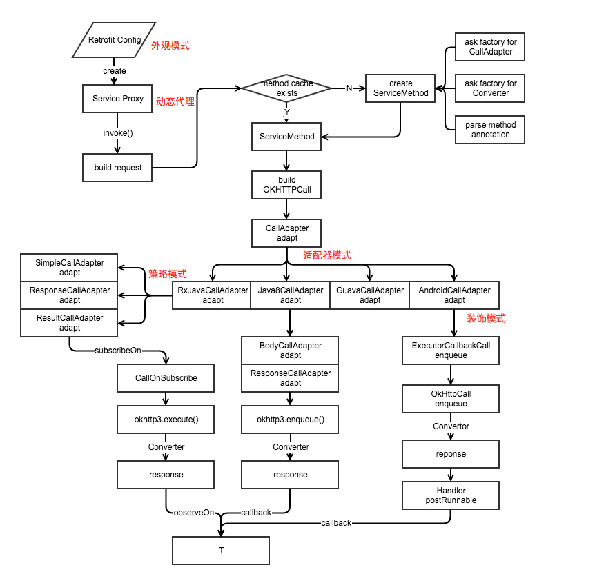

http://www.jianshu.com/p/45cb536be2f4

<div align=center>

</div>

Retrofit.class
```java
  private final Map<Method, ServiceMethod<?, ?>> serviceMethodCache = new ConcurrentHashMap<>();

  final okhttp3.Call.Factory callFactory;
  final HttpUrl baseUrl;
  final List<Converter.Factory> converterFactories;
  final List<CallAdapter.Factory> adapterFactories;
  final @Nullable Executor callbackExecutor;
  final boolean validateEagerly;

  public static final class Builder {
    private final Platform platform;
    private @Nullable okhttp3.Call.Factory callFactory;
    private HttpUrl baseUrl;
    private final List<Converter.Factory> converterFactories = new ArrayList<>();
    private final List<CallAdapter.Factory> adapterFactories = new ArrayList<>();
    private @Nullable Executor callbackExecutor;
    private boolean validateEagerly;
  }
```

# 使用实例
```java
public class LearnRetrofit {
    public static final String API_URL = "https://api.github.com";

      //创建接口
      public interface GitHub {
        @GET("/repos/{owner}/{repo}/contributors")
        Call<ResponseBody> contributors(
            @Path("owner") String owner,
            @Path("repo") String repo);
      }

      public static void main(String[] args) throws IOException {
        //创建Retrofit对象
        Retrofit retrofit = new Retrofit.Builder()
            .baseUrl(API_URL)
            .build();

        //动态生成一个代理对象
        GitHub github = retrofit.create(GitHub.class);

        //生成一个OKHttpCall的代理对象
        Call<ResponseBody> call = github.contributors("square", "retrofit");

        //返回结果
        Response<ResponseBody> response = call.execute();

        //打印数据
        System.out.println(response.body().string());
      }
}
```
我们从官方文档里的一个例子开始。我做了一些修改，开始不使用GsonConverter对结果进行转换，后面会添加，在默认情况下Retrofit只支持将HTTP的响应体转换换为ResponseBody（OKHttp中的类），默认情况下Retrofit使用BuiltInConverters这个默认的Converter，后面会再次提到。第一步，创建一个接口。第二步，创建一个Retrofit对象，提供BASE_URL等信息。第三步，创建一个实现了接口的代理对象。第四步，调用接口方法，返回一个Call对象。第五步，调用execute执行同步请求。第六步，从响应获取数据。我们跟着步骤一步一步分析。


```java
    /**
     * Set the API base URL.
     *
     * @see #baseUrl(HttpUrl)
     */
    public Builder baseUrl(String baseUrl) {
      checkNotNull(baseUrl, "baseUrl == null");
      HttpUrl httpUrl = HttpUrl.parse(baseUrl);
      if (httpUrl == null) {
        throw new IllegalArgumentException("Illegal URL: " + baseUrl);
      }
      return baseUrl(httpUrl);
    }

    public Builder baseUrl(HttpUrl baseUrl) {
      checkNotNull(baseUrl, "baseUrl == null");
      List<String> pathSegments = baseUrl.pathSegments();
      if (!"".equals(pathSegments.get(pathSegments.size() - 1))) {
        throw new IllegalArgumentException("baseUrl must end in /: " + baseUrl);
      }
      this.baseUrl = baseUrl;
      return this;
    }
```

```java
  public <T> T create(final Class<T> service) {
    // 校验是否为接口，且不能继承其他接口
    Utils.validateServiceInterface(service);
    // 是否需要提前解析接口方法
    if (validateEagerly) {
      eagerlyValidateMethods(service);
    }

    // 动态代理模式
    return (T) Proxy.newProxyInstance(service.getClassLoader(), new Class<?>[] { service },
        new InvocationHandler() {
          private final Platform platform = Platform.get();

          @Override public Object invoke(Object proxy, Method method, @Nullable Object[] args)
              throws Throwable {
            // If the method is a method from Object then defer to normal invocation.
            if (method.getDeclaringClass() == Object.class) {
              return method.invoke(this, args);
            }
            // java8默认方法，1.8的新特性
            if (platform.isDefaultMethod(method)) {
              return platform.invokeDefaultMethod(method, service, proxy, args);
            }
            // 这里是核心代码了
            // 将接口中的方法构造为 ServiceMethod
            ServiceMethod<Object, Object> serviceMethod =
                (ServiceMethod<Object, Object>) loadServiceMethod(method);
            OkHttpCall<Object> okHttpCall = new OkHttpCall<>(serviceMethod, args);
            return serviceMethod.callAdapter.adapt(okHttpCall);
          }
        });
  }
```

```java
  ServiceMethod<?, ?> loadServiceMethod(Method method) {
    // 从缓存里面取出，如果有的话，直接返回好了
    ServiceMethod<?, ?> result = serviceMethodCache.get(method);
    if (result != null) return result;

    synchronized (serviceMethodCache) {
      result = serviceMethodCache.get(method);
      if (result == null) {
        // 为null的话，解析方法的注解和返回类型、参数的注解he参数类型，新建一个ServiceMethod
        result = new ServiceMethod.Builder<>(this, method).build();
        // 新建的ServiceMethod加到缓存列表里面
        serviceMethodCache.put(method, result);
      }
    }
    return result;
  }
```

# ServiceMethod.class
```java
  static final class Builder {
    Builder(Retrofit retrofit, Method method) {
      this.retrofit = retrofit;
      this.method = method;
      // 接口方法的注解
      this.methodAnnotations = method.getAnnotations();
      // 接口方法的参数类型
      this.parameterTypes = method.getGenericParameterTypes();
      // 接口方法参数的注解
      this.parameterAnnotationsArray = method.getParameterAnnotations();
    }
  }
    public ServiceMethod build() {
      // 获取CallAdapter的实现，一般为ExecutorCallAdapterFactory.get实现
      callAdapter = createCallAdapter();
      // calladapter 的响应类型中的泛型，比如 Call<User> 中的 User
      responseType = callAdapter.responseType();
      if (responseType == Response.class || responseType == okhttp3.Response.class) {
        throw methodError("'"
            + Utils.getRawType(responseType).getName()
            + "' is not a valid response body type. Did you mean ResponseBody?");
      }
      // 响应的转换工厂，如GsonConverterFactory
      // 根据之前泛型中的类型以及接口方法的注解创建 ResponseConverter
      responseConverter = createResponseConverter();

      // 根据接口方法的注解构造请求方法，比如 @GET @POST @DELETE 等
      // 另外还有添加请求头，检查url中有无带?，转化 path 中的参数
      for (Annotation annotation : methodAnnotations) {
        // 真正解析方法注解的地方来了
        parseMethodAnnotation(annotation);
      }

      if (httpMethod == null) {
        throw methodError("HTTP method annotation is required (e.g., @GET, @POST, etc.).");
      }

      // 若无 body 则不能有 isMultipart 和 isFormEncoded
      if (!hasBody) { // POST方法需要有body或者表单
        if (isMultipart) {
          throw methodError(
              "Multipart can only be specified on HTTP methods with request body (e.g., @POST).");
        }
        if (isFormEncoded) {
          throw methodError("FormUrlEncoded can only be specified on HTTP methods with "
              + "request body (e.g., @POST).");
        }
      }

    // 下面的代码主要用来解析接口方法参数中的注解，比如 @Path @Query @QueryMap @Field 等等
    // 相应的，每个方法的参数都创建了一个 ParameterHandler<?> 对象
      // 上面是请求方法，下面是请求参数
      int parameterCount = parameterAnnotationsArray.length;
      // ParameterHandler的实现类有很多，包括了各种参数，@Field、@Query等
      parameterHandlers = new ParameterHandler<?>[parameterCount];
      for (int p = 0; p < parameterCount; p++) {
        Type parameterType = parameterTypes[p];
        // 和之前一样的泛型、通配符检查
        if (Utils.hasUnresolvableType(parameterType)) {
          throw parameterError(p, "Parameter type must not include a type variable or wildcard: %s",
              parameterType);
        }

        // 参数的注解集合
        Annotation[] parameterAnnotations = parameterAnnotationsArray[p];
        if (parameterAnnotations == null) {
          throw parameterError(p, "No Retrofit annotation found.");
        }

        // 生成了对应的参数注解ParameterHandler实例
        parameterHandlers[p] = parseParameter(p, parameterType, parameterAnnotations);
      }

      // 对方法的一些检测
      // 检查构造出的请求有没有不对的地方？
      if (relativeUrl == null && !gotUrl) {
        throw methodError("Missing either @%s URL or @Url parameter.", httpMethod);
      }
      if (!isFormEncoded && !isMultipart && !hasBody && gotBody) {
        throw methodError("Non-body HTTP method cannot contain @Body.");
      }
      if (isFormEncoded && !gotField) {
        throw methodError("Form-encoded method must contain at least one @Field.");
      }
      if (isMultipart && !gotPart) {
        throw methodError("Multipart method must contain at least one @Part.");
      }

      return new ServiceMethod<>(this);
    }
```
在 build() 中代码挺长的，总结起来就一句话：就是将 API 接口中的方法进行解析，构造成 ServiceMethod ，交给下面的 OkHttpCall 使用。

# OkHttpCall
在 OkHttpCall 的构造器中没什么大动作，搞不了大事情的：
```java
  OkHttpCall(ServiceMethod<T> serviceMethod, Object[] args) {
    this.serviceMethod = serviceMethod;
    this.args = args;
  }
```
而真正搞事情的是 serviceMethod.callAdapter.adapt(okHttpCall); 这句代码。

# CallAdapter.Factory 
在 Retrofit 中默认的 callAdapterFactory 是 ExecutorCallAdapterFactory 。我们就进入它的 get(Type returnType, Annotation[] annotations, Retrofit retrofit) 看看吧，返回了一个匿名类 CallAdapter<Object, Call<?>> ，在其中有 adapt(Call<Object> call) 方法：
```java
  @Override
  public CallAdapter<?, ?> get(Type returnType, Annotation[] annotations, Retrofit retrofit) {
    if (getRawType(returnType) != Call.class) {
      return null;
    }
    final Type responseType = Utils.getCallResponseType(returnType);
    return new CallAdapter<Object, Call<?>>() {
      @Override public Type responseType() {
        return responseType;
      }

      @Override public Call<Object> adapt(Call<Object> call) {
        return new ExecutorCallbackCall<>(callbackExecutor, call);
      }
    };
  }
```
可以看到它 return new ExecutorCallbackCall<>(callbackExecutor, call); 。ExecutorCallbackCall 是实现了 retrofit2.Call ，这里注意下，是 Retrofit 中的 Call 而不是 OkHttp 中的 Call 。使用了装饰者模式把 retrofit2.Call 又包装了一层。

在得到了 ExecutorCallbackCall ，我们可以调用同步方法 execute() 或异步方法 enqueue(Callback<T> callback) 来执行该 call 。

## ExecutorCallAdapterFactory.ExecutorCallbackCall

那我们就跟进同步方法 execute() 吧，异步的 enqueue(Callback<T> callback) 就不看了。了解过 OkHttp 的同学应该都知道这两个方法的区别，就是多了异步执行和回调的步骤而已。
```java
  @Override 
  public Response<T> execute() throws IOException {
    // delegate 就是构造器中传进来的 OkHttpCall
    return delegate.execute();
  }
```

所以，其实就是调用了 OkHttpCall 的 execute() 方法。

所以我们又要回到 OkHttpCall 中了。


# OkHttpCall
```java
  @Override public Response<T> execute() throws IOException {
    okhttp3.Call call;

    synchronized (this) {
      if (executed) throw new IllegalStateException("Already executed.");
      executed = true;

      if (creationFailure != null) {
        if (creationFailure instanceof IOException) {
          throw (IOException) creationFailure;
        } else {
          throw (RuntimeException) creationFailure;
        }
      }

      call = rawCall;
      if (call == null) {
        try {
        // 根据 serviceMethod 中的众多数据创建出 Okhttp 中的 Request 对象
        // 注意的一点，会调用上面的 ParameterHandler.apply 方法来填充网络请求参数
        // 然后再根据 OkhttpClient 创建出 Okhttp 中的 Call
        // 这一步也说明了在 Retrofit 中的 OkHttpCall 内部请求最后会转换为 OkHttp 的 Call
          call = rawCall = createRawCall();
        } catch (IOException | RuntimeException e) {
          creationFailure = e;
          throw e;
        }
      }
    }

    if (canceled) {
      call.cancel();
    }

    // 执行 call 并转换响应的 response
    return parseResponse(call.execute());
  }

  private okhttp3.Call createRawCall() throws IOException {
    Request request = serviceMethod.toRequest(args);
    okhttp3.Call call = serviceMethod.callFactory.newCall(request);
    if (call == null) {
      throw new NullPointerException("Call.Factory returned null.");
    }
    return call;
  }
```
在 execute() 做的就是将 Retrofit 中的 call 转化为 OkHttp 中的 call 。

最后让 OkHttp 的 call 去执行。

至此，Retrofit 的网络请求部分源码已经全部解析一遍了。

剩下的就是响应部分了，趁热打铁。

```java
  Response<T> parseResponse(okhttp3.Response rawResponse) throws IOException {
    ResponseBody rawBody = rawResponse.body();

    // Remove the body's source (the only stateful object) so we can pass the response along.
    rawResponse = rawResponse.newBuilder()
        .body(new NoContentResponseBody(rawBody.contentType(), rawBody.contentLength()))
        .build();

    // 如果返回的响应码不是成功的话，返回错误 Response
    int code = rawResponse.code();
    if (code < 200 || code >= 300) {
      try {
        // Buffer the entire body to avoid future I/O.
        ResponseBody bufferedBody = Utils.buffer(rawBody);
        return Response.error(bufferedBody, rawResponse);
      } finally {
        rawBody.close();
      }
    }

    // 如果返回的响应码是204或者205，返回没有 body 的成功 Response
    if (code == 204 || code == 205) {
      rawBody.close();
      return Response.success(null, rawResponse);
    }

    ExceptionCatchingRequestBody catchingBody = new ExceptionCatchingRequestBody(rawBody);
    try {
      // 将 body 转换为对应的泛型，然后返回成功 Response
      T body = serviceMethod.toResponse(catchingBody);
      return Response.success(body, rawResponse);
    } catch (RuntimeException e) {
      // If the underlying source threw an exception, propagate that rather than indicating it was
      // a runtime exception.
      catchingBody.throwIfCaught();
      throw e;
    }
  }
```

ServiveMethod.class
```java
  /** Builds a method return value from an HTTP response body. */
  R toResponse(ResponseBody body) throws IOException {
    return responseConverter.convert(body);
  }
```

# BuiltInConverters
BuiltInConverters 中有好几种内置的 Converter 。并且只支持返回 ResponseBody 。我们来看下它们的实现：
```java
  static final class StreamingResponseBodyConverter
        implements Converter<ResponseBody, ResponseBody> {
    static final StreamingResponseBodyConverter INSTANCE = new StreamingResponseBodyConverter();

    @Override
    public ResponseBody convert(ResponseBody value) throws IOException {
        return value;
    }
  }

  static final class BufferingResponseBodyConverter
        implements Converter<ResponseBody, ResponseBody> {
    static final BufferingResponseBodyConverter INSTANCE = new BufferingResponseBodyConverter();

    @Override
    public ResponseBody convert(ResponseBody value) throws IOException {
        try {
            // Buffer the entire body to avoid future I/O.
            return Utils.buffer(value);
        } finally {
            value.close();
        }
    }
  }
```
其实说白了就是将 ResponseBody 转化为对应的数据类型了。比如在 GsonConverterFactory 中就是把 ResponseBody 用 gson 转化为对应的类型


# 注解解析
```java
    private void parseMethodAnnotation(Annotation annotation) {
      if (annotation instanceof DELETE) {
        parseHttpMethodAndPath("DELETE", ((DELETE) annotation).value(), false);
      } else if (annotation instanceof GET) {
        parseHttpMethodAndPath("GET", ((GET) annotation).value(), false);
      } else if (annotation instanceof HEAD) {
        parseHttpMethodAndPath("HEAD", ((HEAD) annotation).value(), false);
        if (!Void.class.equals(responseType)) {
          throw methodError("HEAD method must use Void as response type.");
        }
      } else if (annotation instanceof PATCH) {
        parseHttpMethodAndPath("PATCH", ((PATCH) annotation).value(), true);
      } else if (annotation instanceof POST) {
        parseHttpMethodAndPath("POST", ((POST) annotation).value(), true);
      } else if (annotation instanceof PUT) {
        parseHttpMethodAndPath("PUT", ((PUT) annotation).value(), true);
      } else if (annotation instanceof OPTIONS) {
        parseHttpMethodAndPath("OPTIONS", ((OPTIONS) annotation).value(), false);
      } else if (annotation instanceof HTTP) {
        HTTP http = (HTTP) annotation;
        parseHttpMethodAndPath(http.method(), http.path(), http.hasBody());
      } else if (annotation instanceof retrofit2.http.Headers) {
        String[] headersToParse = ((retrofit2.http.Headers) annotation).value();
        if (headersToParse.length == 0) {
          throw methodError("@Headers annotation is empty.");
        }
        headers = parseHeaders(headersToParse);
      } else if (annotation instanceof Multipart) {
        if (isFormEncoded) {
          throw methodError("Only one encoding annotation is allowed.");
        }
        isMultipart = true;
      } else if (annotation instanceof FormUrlEncoded) {
        if (isMultipart) {
          throw methodError("Only one encoding annotation is allowed.");
        }
        isFormEncoded = true;
      }
    }

    private void parseHttpMethodAndPath(String httpMethod, String value, boolean hasBody) {
      if (this.httpMethod != null) {
        throw methodError("Only one HTTP method is allowed. Found: %s and %s.",
            this.httpMethod, httpMethod);
      }
      this.httpMethod = httpMethod;
      this.hasBody = hasBody;

      if (value.isEmpty()) {
        return;
      }

      // Get the relative URL path and existing query string, if present.
      int question = value.indexOf('?');
      if (question != -1 && question < value.length() - 1) {
        // Ensure the query string does not have any named parameters.
        String queryParams = value.substring(question + 1);
        Matcher queryParamMatcher = PARAM_URL_REGEX.matcher(queryParams);
        if (queryParamMatcher.find()) {
          throw methodError("URL query string \"%s\" must not have replace block. "
              + "For dynamic query parameters use @Query.", queryParams);
        }
      }

      this.relativeUrl = value;
      this.relativeUrlParamNames = parsePathParameters(value);
    }
```


# Retrofit.Builder
```java
  public Builder client(OkHttpClient client);
  public Builder callFactory(okhttp3.Call.Factory factory);
  public Builder baseUrl(String baseUrl);
  public Builder baseUrl(HttpUrl baseUrl);
  public Builder addConverterFactory(Converter.Factory factory);
  public Builder addConverterFactory(Converter.Factory factory);
  public Builder callbackExecutor(Executor executor);
  public Builder validateEagerly(boolean validateEagerly);

  Builder(Retrofit retrofit) {
    platform = Platform.get();
    callFactory = retrofit.callFactory;
    baseUrl = retrofit.baseUrl;
    converterFactories.addAll(retrofit.converterFactories);
    adapterFactories.addAll(retrofit.adapterFactories);
    // Remove the default, platform-aware call adapter added by build().
    adapterFactories.remove(adapterFactories.size() - 1);
    callbackExecutor = retrofit.callbackExecutor;
    validateEagerly = retrofit.validateEagerly;
  }

  public Retrofit build() {
    if (baseUrl == null) {
      throw new IllegalStateException("Base URL required.");
    }

    okhttp3.Call.Factory callFactory = this.callFactory;
    if (callFactory == null) {
      callFactory = new OkHttpClient();
    }

    Executor callbackExecutor = this.callbackExecutor;
    if (callbackExecutor == null) {
      callbackExecutor = platform.defaultCallbackExecutor();
    }

    // Make a defensive copy of the adapters and add the default Call adapter.
    List<CallAdapter.Factory> adapterFactories = new ArrayList<>(this.adapterFactories);
    adapterFactories.add(platform.defaultCallAdapterFactory(callbackExecutor));

    // Make a defensive copy of the converters.
    List<Converter.Factory> converterFactories = new ArrayList<>(this.converterFactories);

    return new Retrofit(callFactory, baseUrl, converterFactories, adapterFactories,
      callbackExecutor, validateEagerly);
  }
```

在 Retrofit.Builder 中有以下的方法：
* client： 设置 http client，默认是 OkHttpClient，会调用 callFactory 方法
* callFactory： 设置网络请求 call 的工厂，默认就是上面的 OkHttpClient
* baseUrl： api 的 baseurl
* addConverterFactory： 添加数据转换器工厂
* addCallAdapterFactory：　添加网络请求适配器工厂
* callbackExecutor： 回调方法执行器
* validateEagerly： 是否提前解析接口方法


# Platform
```java
class Platform {
  private static final Platform PLATFORM = findPlatform();

  static Platform get() {
    return PLATFORM;
  }

  private static Platform findPlatform() {
    try {
      Class.forName("android.os.Build");
      if (Build.VERSION.SDK_INT != 0) {
        return new Android();
      }
    } catch (ClassNotFoundException ignored) {
    }
    try {
      Class.forName("java.util.Optional");
      return new Java8();
    } catch (ClassNotFoundException ignored) {
    }
    return new Platform();
  }

  @Nullable Executor defaultCallbackExecutor() {
    return null;
  }

  CallAdapter.Factory defaultCallAdapterFactory(@Nullable Executor callbackExecutor) {
    if (callbackExecutor != null) {
      return new ExecutorCallAdapterFactory(callbackExecutor);
    }
    return DefaultCallAdapterFactory.INSTANCE;
  }

  boolean isDefaultMethod(Method method) {
    return false;
  }

  @Nullable Object invokeDefaultMethod(Method method, Class<?> declaringClass, Object object,
      @Nullable Object... args) throws Throwable {
    throw new UnsupportedOperationException();
  }
}
```

# 参考博客
http://blog.csdn.net/lmj623565791/article/details/51304204

http://www.jianshu.com/p/0c055ad46b6c

https://juejin.im/entry/59867cdff265da3e292a6121