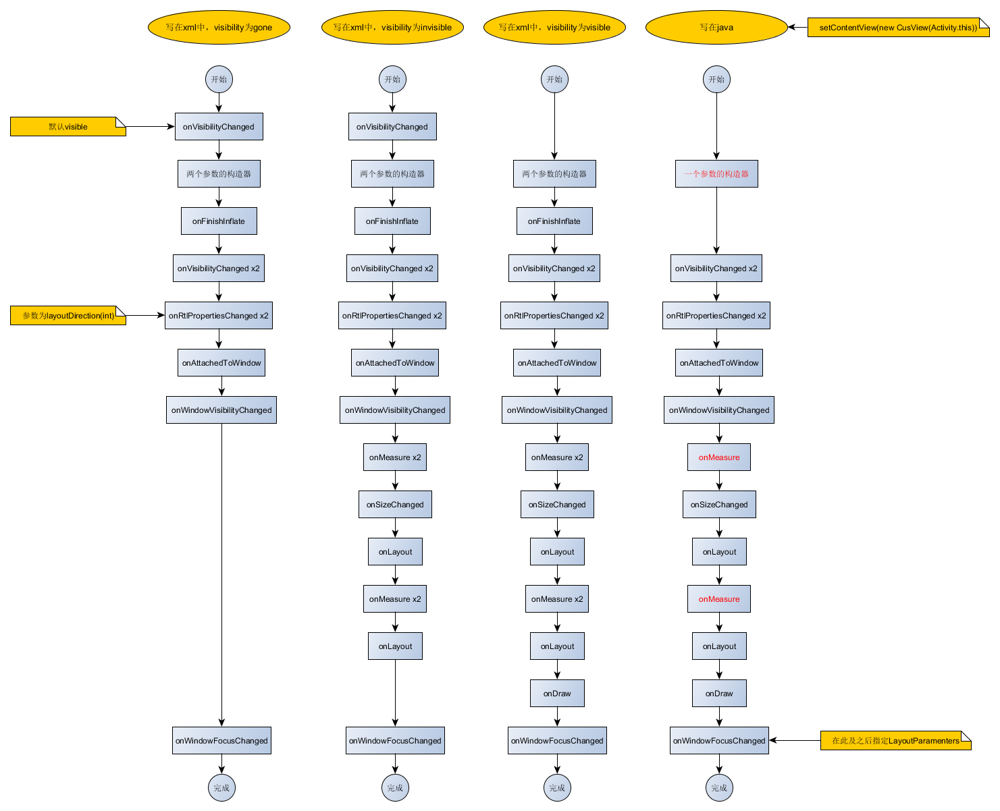
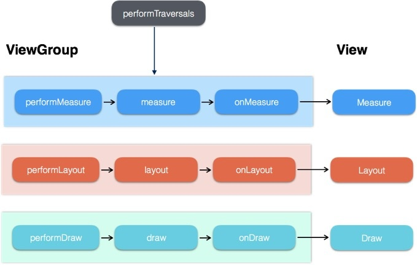
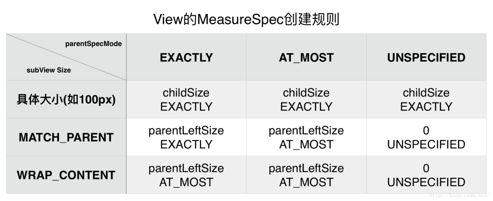

https://juejin.im/entry/5a654365f265da3e3e33e258

# View的生命周期方法
* 创建
    * 构造方法：通常每个控件都会有多个构造方法；如果在代码中创建该控件会用到包含一个Context的构造；如果需要布局中使用，则必须使用带有AttributeSet参数的构造。其它的还有带有主题的构造。
    * onFinishInflate()：当一个View和它的所有子View从布局文件中inflate完成后调用。
* 布局
    * onMeasure(int,int):测量当前View 和它的子View的需要的尺寸大小
    * onLayout(boolean,int,int,int,int):给当前View的所有的子View 分配尺寸大小和位置
    * onSizeChanged(int,int,int,init):当前View的尺寸发生变化时调用
* 绘制
    * onDraw(Canvas):当View需要渲染内容时调用（将我们需要的内容画到view时调用）
* 事件处理
    * onKeyDown(int,KeyEvent):当前键盘（物理键）上某个键按下时调用
    * onKeyUp(int,KeyEvent):当按下的键弹起时调用
    * onTrackballEvent(MotionEvent):当轨迹球发生运动时调用
    * onTouchEvent(MotionEvent):当触摸事件发生时调用
* 焦点
    * onFocusChanged(boolean,int,Rect):当焦点发生变化时调用（这里变化包括获取到焦点和失去焦点）
    * onWindowFocusChanged(boolean):包含当前View的Window的焦点发生变化时调用（这里变化包括获取到焦点和失去焦点）
* 附着
    * onAttachedToWindow():当View附着到Window上时调用
    * onDetachedFromWindow():当View从Window上分离时调用
    * onWindowVisibilityChanged(int):包含当前View的Window的可见性发生改变时调用

* xml visibility = gone (默认是visible)

onVisibilityChanged -> 俩参数构造器 -> onFinishInflate -> onVisibilityChanged × 2
-> onRtlPropertiesChanged × 2 -> onAttachedToWindow -> onWindowVisibilityChanged
-> onWindowFocusChanged

* xml visibility = invisible

onVisibilityChanged -> 俩参数构造器 -> onFinishInflate -> onVisibilityChanged × 2
-> onRtlPropertiesChanged × 2 -> onAttachedToWindow -> onWindowVisibilityChanged
-> onMeasure × 2 -> onSizeChanged -> onLayout
-> onMeasure  × 2 -> onLayout -> onWindowFocusChanged

* xml visibility = visible

俩参数构造器 -> onFinishInflate -> onVisibilityChanged × 2
-> onRtlPropertiesChanged × 2 -> onAttachedToWindow -> onWindowVisibilityChanged
-> onMeasure × 2 -> onSizeChanged -> onLayout
-> onMeasure  × 2 -> onLayout -> onDraw -> onWindowFocusChanged

* java setContentView(new MyView(this))

单参数构造器  -> onVisibilityChanged × 2
-> onRtlPropertiesChanged × 2 -> onAttachedToWindow -> onWindowVisibilityChanged
-> onMeasure -> onSizeChanged -> onLayout
-> onMeasure -> onLayout -> onDraw -> onWindowFocusChanged(在此之后指定LayoutParams)

<div align=center>
    
</div>

http://www.jianshu.com/p/08e6dab7886e

# [事件分发](http://www.gcssloop.com/customview/dispatch-touchevent-theory)

事件分发可以用下面的伪代码表示：
```java
// 点击事件产生后，会直接调用dispatchTouchEvent（）方法
public boolean dispatchTouchEvent(MotionEvent ev) {

    //代表是否消耗事件
    boolean consume = false;


    if (onInterceptTouchEvent(ev)) {
    // 如果onInterceptTouchEvent()返回true则代表当前View拦截了点击事件
    // 则该点击事件则会交给当前View进行处理
    // 即调用onTouchEvent (）方法去处理点击事件
      consume = onTouchEvent (ev) ;
    } else {
      // 如果onInterceptTouchEvent()返回false则代表当前View不拦截点击事件
      // 则该点击事件则会继续传递给它的子元素
      // 子元素的dispatchTouchEvent（）就会被调用，重复上述过程
      // 直到点击事件被最终处理为止
      consume = child.dispatchTouchEvent (ev) ;
    }

    return consume;
   }
```


## Activity 事件分发
```java
    public boolean dispatchTouchEvent(MotionEvent ev) {
        if (ev.getAction() == MotionEvent.ACTION_DOWN) {
            onUserInteraction();
        }
        if (getWindow().superDispatchTouchEvent(ev)) {
            return true;
        }
        return onTouchEvent(ev);
    }
```

这里的getWindow()其实是一个PhoneWindow, PhoneWindow将事件传递给了DecorView, DecorView是一个顶级父View。
```java
    @Override
    public boolean superDispatchTouchEvent(MotionEvent event) {
        return mDecor.superDispatchTouchEvent(event);
    }

    public class DecorView extends FrameLayout implements RootViewSurfaceTaker, WindowCallbacks {
        
        @Override
        public boolean dispatchTouchEvent(MotionEvent ev) {
            final Window.Callback cb = mWindow.getCallback();
            return cb != null && !mWindow.isDestroyed() && mFeatureId < 0
                ? cb.dispatchTouchEvent(ev) : super.dispatchTouchEvent(ev);
        }

        public boolean superDispatchTouchEvent(MotionEvent event) {
            return super.dispatchTouchEvent(event);
        }
    }
```
最后事件传给了DecorView的父类FrameLayout.

## MotionEvent
常见事件:
* ACTION_DOWN
* ACTION_MOVE
* ACTION_UP

* ACTION_CANCEL

ACTION_CANCEL 的触发条件是事件被上层拦截，然而我们在 事件分发机制原理 一文中了解到当事件被上层 View 拦截的时候，ChildView 是收不到任何事件的，ChildView 收不到任何事件，自然也不会收到 ACTION_CANCEL 了，所以说这个 ACTION_CANCEL 的正确触发条件并不是这样，那么是什么呢？

事实上，只有上层 View 回收事件处理权的时候，ChildView 才会收到一个 ACTION_CANCEL 事件。

**举个例子**:


    例如：上层 View 是一个 RecyclerView，它收到了一个 ACTION_DOWN 事件，由于这个可能是点击事件，所以它先传递给对应 ItemView，询问 ItemView 是否需要这个事件，然而接下来又传递过来了一个 ACTION_MOVE 事件，且移动的方向和 RecyclerView 的可滑动方向一致，所以 RecyclerView 判断这个事件是滚动事件，于是要收回事件处理权，这时候对应的 ItemView 会收到一个 ACTION_CANCEL ，并且不会再收到后续事件。

    通俗一点？

    RecyclerView：儿砸，这里有一个 ACTION_DOWN 你看你要不要。
    ItemView ：好嘞，我看看。
    RecyclerView：噫？居然是移动事件ACTION_MOVE，我要滚起来了，儿砸，我可能要把你送去你姑父家(缓存区)了，在这之前给你一个 ACTION_CANCEL，你要收好啊。
    ItemView ：……

    这是实际开发中最有可能见到 ACTION_CANCEL 的场景了。


* ACTION_OUTSIDE


     A movement has happened outside of the normal bounds of the UI element. This does not provide a full gesture, but only the initial location of the movement/touch.

    一个触摸事件已经发生了UI元素的正常范围之外。因此不再提供完整的手势，只提供 运动/触摸 的初始位置。

我们知道，正常情况下，如果初始点击位置在该视图区域之外，该视图根本不可能会收到事件，然而，万事万物都不是绝对的，肯定还有一些特殊情况，你可曾还记得点击 Dialog 区域外关闭吗？Dialog 就是一个特殊的视图(没有占满屏幕大小的窗口)，能够接收到视图区域外的事件(虽然在通常情况下你根本用不到这个事件)，除了 Dialog 之外，你最可能看到这个事件的场景是悬浮窗，当然啦，想要接收到视图之外的事件需要一些特殊的设置。

    设置视图的 WindowManager 布局参数的 flags为FLAG_WATCH_OUTSIDE_TOUCH，这样点击事件发生在这个视图之外时，该视图就可以接收到一个 ACTION_OUTSIDE 事件。

    参见StackOverflow：[How to dismiss the dialog with click on outside of the dialog?](https://stackoverflow.com/questions/8384067/how-to-dismiss-the-dialog-with-click-on-outside-of-the-dialog)

* ACTION_POINTER_DOWN 有非主要的手指按下(即按下之前已经有手指在屏幕上)

* ACTION_POINTER_UP 	有非主要的手指抬起(即抬起之后仍然有手指在屏幕上)


### View的事件分发

首先我们先看dispatchTouchEvent方法
```java
    public boolean dispatchTouchEvent(MotionEvent event) {
        // If the event should be handled by accessibility focus first.
        if (event.isTargetAccessibilityFocus()) {
            // We don't have focus or no virtual descendant has it, do not handle the event.
            if (!isAccessibilityFocusedViewOrHost()) {
                return false;
            }
            // We have focus and got the event, then use normal event dispatch.
            event.setTargetAccessibilityFocus(false);
        }

        boolean result = false;

        if (mInputEventConsistencyVerifier != null) {
            mInputEventConsistencyVerifier.onTouchEvent(event, 0);
        }

        final int actionMasked = event.getActionMasked();
        if (actionMasked == MotionEvent.ACTION_DOWN) {
            // Defensive cleanup for new gesture
            stopNestedScroll();
        }

        if (onFilterTouchEventForSecurity(event)) {
            if ((mViewFlags & ENABLED_MASK) == ENABLED && handleScrollBarDragging(event)) {
                result = true;
            }
            //noinspection SimplifiableIfStatement
            ListenerInfo li = mListenerInfo;
            /** 
            * 如果设置了OnTouchListener，并且当前 View 可点击，就调用监听器的 onTouch 方法，
            * 如果 onTouch 方法返回值为 true，就设置 result 为 true。
            */
            if (li != null && li.mOnTouchListener != null
                    && (mViewFlags & ENABLED_MASK) == ENABLED
                    && li.mOnTouchListener.onTouch(this, event)) {
                result = true;
            }

            /** 
            * 如果 result 为 false，则调用自身的 onTouchEvent。
            * 如果 onTouchEvent 返回值为 true，则设置 result 为 true。
            */
            if (!result && onTouchEvent(event)) {
                result = true;
            }
        }

        if (!result && mInputEventConsistencyVerifier != null) {
            mInputEventConsistencyVerifier.onUnhandledEvent(event, 0);
        }

        // Clean up after nested scrolls if this is the end of a gesture;
        // also cancel it if we tried an ACTION_DOWN but we didn't want the rest
        // of the gesture.
        if (actionMasked == MotionEvent.ACTION_UP ||
                actionMasked == MotionEvent.ACTION_CANCEL ||
                (actionMasked == MotionEvent.ACTION_DOWN && !result)) {
            stopNestedScroll();
        }

        return result;
    }
```
事件的调度顺序应该是 onTouchListener -> onTouchEvent -> onLongClickListener -> onClickListener

接下来我们看onTouch方法:
```java
    public boolean onTouchEvent(MotionEvent event) {
        final float x = event.getX();
        final float y = event.getY();
        final int viewFlags = mViewFlags;
        final int action = event.getAction();

        if ((viewFlags & ENABLED_MASK) == DISABLED) {
            if (action == MotionEvent.ACTION_UP && (mPrivateFlags & PFLAG_PRESSED) != 0) {
                setPressed(false);
            }
            // A disabled view that is clickable still consumes the touch
            // events, it just doesn't respond to them.
            return (((viewFlags & CLICKABLE) == CLICKABLE
                    || (viewFlags & LONG_CLICKABLE) == LONG_CLICKABLE)
                    || (viewFlags & CONTEXT_CLICKABLE) == CONTEXT_CLICKABLE);
        }
        if (mTouchDelegate != null) {
            if (mTouchDelegate.onTouchEvent(event)) {
                return true;
            }
        }

        // 检查各种 clickable
        if (((viewFlags & CLICKABLE) == CLICKABLE ||
                (viewFlags & LONG_CLICKABLE) == LONG_CLICKABLE) ||
                (viewFlags & CONTEXT_CLICKABLE) == CONTEXT_CLICKABLE) {
            switch (action) {
                case MotionEvent.ACTION_UP:
                    boolean prepressed = (mPrivateFlags & PFLAG_PREPRESSED) != 0;
                    if ((mPrivateFlags & PFLAG_PRESSED) != 0 || prepressed) {
                        // take focus if we don't have it already and we should in
                        // touch mode.
                        boolean focusTaken = false;
                        if (isFocusable() && isFocusableInTouchMode() && !isFocused()) {
                            focusTaken = requestFocus();
                        }

                        if (prepressed) {
                            // The button is being released before we actually
                            // showed it as pressed.  Make it show the pressed
                            // state now (before scheduling the click) to ensure
                            // the user sees it.
                            setPressed(true, x, y);
                       } 

                        if (!mHasPerformedLongPress && !mIgnoreNextUpEvent) {
                            // This is a tap, so remove the longpress check
                            removeLongPressCallback(); // 移除长按

                            // Only perform take click actions if we were in the pressed state
                            if (!focusTaken) {
                                // Use a Runnable and post this rather than calling
                                // performClick directly. This lets other visual state
                                // of the view update before click actions start.
                                if (mPerformClick == null) {
                                    mPerformClick = new PerformClick();
                                }
                                if (!post(mPerformClick)) {
                                    performClick(); // 检查单击
                                }
                            }
                        }

                        if (mUnsetPressedState == null) {
                            mUnsetPressedState = new UnsetPressedState();
                        }

                        if (prepressed) {
                            postDelayed(mUnsetPressedState,
                                    ViewConfiguration.getPressedStateDuration());
                        } else if (!post(mUnsetPressedState)) {
                            // If the post failed, unpress right now
                            mUnsetPressedState.run();
                        }

                        removeTapCallback();
                    }
                    mIgnoreNextUpEvent = false;
                    break;

                case MotionEvent.ACTION_DOWN:
                    mHasPerformedLongPress = false;

                    if (performButtonActionOnTouchDown(event)) {
                        break;
                    }

                    // Walk up the hierarchy to determine if we're inside a scrolling container.
                    boolean isInScrollingContainer = isInScrollingContainer();

                    // For views inside a scrolling container, delay the pressed feedback for
                    // a short period in case this is a scroll.
                    if (isInScrollingContainer) {
                        mPrivateFlags |= PFLAG_PREPRESSED;
                        if (mPendingCheckForTap == null) {
                            mPendingCheckForTap = new CheckForTap();
                        }
                        mPendingCheckForTap.x = event.getX();
                        mPendingCheckForTap.y = event.getY();
                        postDelayed(mPendingCheckForTap, ViewConfiguration.getTapTimeout());
                    } else {
                        // Not inside a scrolling container, so show the feedback right away
                        setPressed(true, x, y);
                        checkForLongClick(0, x, y); // 检测长按
                    break;

                case MotionEvent.ACTION_CANCEL:
                    setPressed(false);
                    removeTapCallback();
                    removeLongPressCallback();
                    mInContextButtonPress = false;
                    mHasPerformedLongPress = false;
                    mIgnoreNextUpEvent = false;
                    break;

                case MotionEvent.ACTION_MOVE:
                    drawableHotspotChanged(x, y);

                    // Be lenient about moving outside of buttons
                    if (!pointInView(x, y, mTouchSlop)) {
                        // Outside button
                        removeTapCallback();
                        if ((mPrivateFlags & PFLAG_PRESSED) != 0) {
                            // Remove any future long press/tap checks
                            removeLongPressCallback();

                            setPressed(false);
                        }
                    }
                    break;
            }

            return true; // 表示事件被消费
        }

        return false;
    }
```

###  ViewGroup的事件分发
ViewGroup事件分发伪代码：
```java
public boolean dispatchTouchEvent(MotionEvent ev) {
    boolean result = false;             // 默认状态为没有消费过

    if (!onInterceptTouchEvent(ev)) {   // 如果没有拦截交给子View
        result = child.dispatchTouchEvent(ev);
    }

    if (!result) {                      // 如果事件没有被消费,询问自身onTouchEvent
        result = onTouchEvent(ev);
    }

    return result;
}
```

* ViewGroup 中可能有多个 ChildView，如何判断应该分配给哪一个？
这个很容易，就是把所有的 ChildView 遍历一遍，如果手指触摸的点在 ChildView 区域内就分发给这个View。

* 当该点的 ChildView 有重叠时应该如何分配？
当 ChildView 重叠时，一般会分配给显示在最上面的 ChildView。
如何判断哪个是显示在最上面的呢？后面加载的一般会覆盖掉之前的，所以显示在最上面的是最后加载的。

**注意**:

    上面说的是可点击，可点击包括很多种情况，只要你给View注册了 onClickListener、onLongClickListener、OnContextClickListener 其中的任何一个监听器或者设置了 android:clickable=”true” 就代表这个 View 是可点击的。
    另外，某些 View 默认就是可点击的，例如，Button，CheckBox 等。
    给 View 注册 OnTouchListener 不会影响 View 的可点击状态。即使给 View 注册 OnTouchListener ，只要不返回 true 就不会消费事件。

* ViewGroup 和 ChildView 同时注册了事件监听器(onClick等)，哪个会执行?
事件优先给 ChildView，会被 ChildView消费掉，ViewGroup 不会响应。

* 所有事件都应该被同一 View 消费
在上面的例子中我们分析后可以了解到，同一次点击事件只能被一个 View 消费，这是为什呢？主要是为了防止事件响应混乱，如果再一次完整的事件中分别将不同的事件分配给了不同的 View 容易造成事件响应混乱。

    View 中 onClick 事件需要同时接收到 ACTION_DOWN 和 ACTION_UP 才能触发，如果分配给了不同的 View，那么 onClick 将无法被正确触发。

 安卓为了保证所有的事件都是被一个 View 消费的，对第一次的事件( ACTION_DOWN )进行了特殊判断，View 只有消费了 ACTION_DOWN 事件，才能接收到后续的事件(可点击控件会默认消费所有事件)，并且会将后续所有事件传递过来，不会再传递给其他 View，除非上层 View 进行了拦截。如果上层 View 拦截了当前正在处理的事件，会收到一个 ACTION_CANCEL，表示当前事件已经结束，后续事件不会再传递过来。

 ```java
     @Override
    public boolean dispatchTouchEvent(MotionEvent ev) {
        // 调试用
        if (mInputEventConsistencyVerifier != null) {
            mInputEventConsistencyVerifier.onTouchEvent(ev, 1);
        }

        // If the event targets the accessibility focused view and this is it, start
        // normal event dispatch. Maybe a descendant is what will handle the click.
        // 判断事件是否是针对可访问的焦点视图(很晚才添加的内容，个人猜测和屏幕辅助相关，方便盲人等使用设备)
        if (ev.isTargetAccessibilityFocus() && isAccessibilityFocusedViewOrHost()) {
            ev.setTargetAccessibilityFocus(false);
        }

        boolean handled = false;
        if (onFilterTouchEventForSecurity(ev)) {
            final int action = ev.getAction();
            final int actionMasked = action & MotionEvent.ACTION_MASK;

            // Handle an initial down.
            // 处理第一次ACTION_DOWN.
            if (actionMasked == MotionEvent.ACTION_DOWN) {
                // Throw away all previous state when starting a new touch gesture.
                // The framework may have dropped the up or cancel event for the previous gesture
                // due to an app switch, ANR, or some other state change.
                // 清除之前所有的状态
                cancelAndClearTouchTargets(ev);
                resetTouchState();
            }

            // Check for interception.
            // 检查是否需要拦截.
            final boolean intercepted;
            if (actionMasked == MotionEvent.ACTION_DOWN
                    || mFirstTouchTarget != null) {
                final boolean disallowIntercept = (mGroupFlags & FLAG_DISALLOW_INTERCEPT) != 0;
                if (!disallowIntercept) {
                    // 询问是否拦截
                    intercepted = onInterceptTouchEvent(ev); 
                    // 恢复操作，防止被更改
                    ev.setAction(action); // restore action in case it was changed
                } else {
                    intercepted = false;
                }
            } else {
                // There are no touch targets and this action is not an initial down
                // so this view group continues to intercept touches.
                // 没有目标来处理该事件，而且也不是一个新的事件事件(ACTION_DOWN), 进行拦截。
                intercepted = true;
            }

            // If intercepted, start normal event dispatch. Also if there is already
            // a view that is handling the gesture, do normal event dispatch.
            // 判断事件是否是针对可访问的焦点视图
            if (intercepted || mFirstTouchTarget != null) {
                ev.setTargetAccessibilityFocus(false);
            }

            // Check for cancelation.
            // 检查事件是否被取消(ACTION_CANCEL)
            final boolean canceled = resetCancelNextUpFlag(this)
                    || actionMasked == MotionEvent.ACTION_CANCEL;

            // Update list of touch targets for pointer down, if needed.
            final boolean split = (mGroupFlags & FLAG_SPLIT_MOTION_EVENTS) != 0;
            TouchTarget newTouchTarget = null;
            boolean alreadyDispatchedToNewTouchTarget = false;
            // 如果没有取消也没有被拦截	(进入事件分发)
            if (!canceled && !intercepted) {

                // If the event is targeting accessiiblity focus we give it to the
                // view that has accessibility focus and if it does not handle it
                // we clear the flag and dispatch the event to all children as usual.
                // We are looking up the accessibility focused host to avoid keeping
                // state since these events are very rare.
                // 如果事件是针对可访问性焦点视图，我们将其提供给具有可访问性焦点的视图。
          	    // 如果它不处理它，我们清除该标志并像往常一样将事件分派给所有的 ChildView。 
                // 我们检测并避免保持这种状态，因为这些事非常罕见。
                View childWithAccessibilityFocus = ev.isTargetAccessibilityFocus()
                        ? findChildWithAccessibilityFocus() : null;

                if (actionMasked == MotionEvent.ACTION_DOWN
                        || (split && actionMasked == MotionEvent.ACTION_POINTER_DOWN)
                        || actionMasked == MotionEvent.ACTION_HOVER_MOVE) {
                    final int actionIndex = ev.getActionIndex(); // always 0 for down
                    final int idBitsToAssign = split ? 1 << ev.getPointerId(actionIndex)
                            : TouchTarget.ALL_POINTER_IDS;

                    // Clean up earlier touch targets for this pointer id in case they
                    // have become out of sync.
                    // 清除此指针ID的早期触摸目标，防止不同步。
                    removePointersFromTouchTargets(idBitsToAssign);

                    final int childrenCount = mChildrenCount;
                    if (newTouchTarget == null && childrenCount != 0) {
                        // 获取触摸位置坐标
                        final float x = ev.getX(actionIndex);
                        final float y = ev.getY(actionIndex);
                        // Find a child that can receive the event.
                        // Scan children from front to back.
                        // 查找可以接受事件的 ChildView
                        final ArrayList<View> preorderedList = buildTouchDispatchChildList();
                        final boolean customOrder = preorderedList == null
                                && isChildrenDrawingOrderEnabled();
                        final View[] children = mChildren;
                        // 注意，从最后向前扫描
                        for (int i = childrenCount - 1; i >= 0; i--) {
                            final int childIndex = getAndVerifyPreorderedIndex(
                                    childrenCount, i, customOrder);
                            final View child = getAndVerifyPreorderedView(
                                    preorderedList, children, childIndex);

                            // If there is a view that has accessibility focus we want it
                            // to get the event first and if not handled we will perform a
                            // normal dispatch. We may do a double iteration but this is
                            // safer given the timeframe.
                            // 如果有一个视图具有可访问性焦点，我们希望它首先获取事件，
                      	    // 如果不处理，我们将执行正常的分派。 
                      	    // 尽管这可能会分发两次，但它能保证在给定的时间内更安全的执行。
                            if (childWithAccessibilityFocus != null) {
                                if (childWithAccessibilityFocus != child) {
                                    continue;
                                }
                                childWithAccessibilityFocus = null;
                                i = childrenCount - 1;
                            }

                            // 检查View是否允许接受事件(即处于显示状态(VISIBLE)或者正在播放动画)
                      	    // 检查触摸位置是否在View区域内
                            if (!canViewReceivePointerEvents(child)
                                    || !isTransformedTouchPointInView(x, y, child, null)) {
                                ev.setTargetAccessibilityFocus(false);
                                continue;
                            }

                            // getTouchTarget 中判断了 child 是否包含在 mFirstTouchTarget 中
                      	    // 如果有返回 target，如果没有返回 null
                            newTouchTarget = getTouchTarget(child);
                            if (newTouchTarget != null) {
                                // Child is already receiving touch within its bounds.
                                // Give it the new pointer in addition to the ones it is handling.
                                // ChildView 已经准备好接受在其区域内的事件。
                                newTouchTarget.pointerIdBits |= idBitsToAssign;
                                break; // 已经找到目标View，跳出循环
                            }

                            resetCancelNextUpFlag(child);
                            if (dispatchTransformedTouchEvent(ev, false, child, idBitsToAssign)) {
                                // Child wants to receive touch within its bounds.
                                mLastTouchDownTime = ev.getDownTime();
                                if (preorderedList != null) {
                                    // childIndex points into presorted list, find original index
                                    for (int j = 0; j < childrenCount; j++) {
                                        if (children[childIndex] == mChildren[j]) {
                                            mLastTouchDownIndex = j;
                                            break;
                                        }
                                    }
                                } else {
                                    mLastTouchDownIndex = childIndex;
                                }
                                mLastTouchDownX = ev.getX();
                                mLastTouchDownY = ev.getY();
                                newTouchTarget = addTouchTarget(child, idBitsToAssign);
                                alreadyDispatchedToNewTouchTarget = true;
                                break;
                            }

                            // The accessibility focus didn't handle the event, so clear
                            // the flag and do a normal dispatch to all children.
                            ev.setTargetAccessibilityFocus(false);
                        }
                        if (preorderedList != null) preorderedList.clear();
                    }

                    if (newTouchTarget == null && mFirstTouchTarget != null) {
                        // Did not find a child to receive the event.
                        // Assign the pointer to the least recently added target.
                        // 没有找到 ChildView 接收事件
                        newTouchTarget = mFirstTouchTarget;
                        while (newTouchTarget.next != null) {
                            newTouchTarget = newTouchTarget.next;
                        }
                        newTouchTarget.pointerIdBits |= idBitsToAssign;
                    }
                }
            }

            // Dispatch to touch targets.
            // 分发 Touch Target
            if (mFirstTouchTarget == null) {
                // No touch targets so treat this as an ordinary view.
                // 没有 TouchTarget，将当前 ViewGroup 当作普通的 View 处理。
                handled = dispatchTransformedTouchEvent(ev, canceled, null,
                        TouchTarget.ALL_POINTER_IDS);
            } else {
                // Dispatch to touch targets, excluding the new touch target if we already
                // dispatched to it.  Cancel touch targets if necessary.
                // 分发TouchTarget，如果我们已经分发过，则避免分配给新的目标。 
          	    // 如有必要，取消分发。
                TouchTarget predecessor = null;
                TouchTarget target = mFirstTouchTarget;
                while (target != null) {
                    final TouchTarget next = target.next;
                    if (alreadyDispatchedToNewTouchTarget && target == newTouchTarget) {
                        handled = true;
                    } else {
                        final boolean cancelChild = resetCancelNextUpFlag(target.child)
                                || intercepted;
                        if (dispatchTransformedTouchEvent(ev, cancelChild,
                                target.child, target.pointerIdBits)) {
                            handled = true;
                        }
                        if (cancelChild) {
                            if (predecessor == null) {
                                mFirstTouchTarget = next;
                            } else {
                                predecessor.next = next;
                            }
                            target.recycle();
                            target = next;
                            continue;
                        }
                    }
                    predecessor = target;
                    target = next;
                }
            }

            // Update list of touch targets for pointer up or cancel, if needed.
            // 如果需要，更新指针的触摸目标列表或取消。
            if (canceled
                    || actionMasked == MotionEvent.ACTION_UP
                    || actionMasked == MotionEvent.ACTION_HOVER_MOVE) {
                resetTouchState();
            } else if (split && actionMasked == MotionEvent.ACTION_POINTER_UP) {
                final int actionIndex = ev.getActionIndex();
                final int idBitsToRemove = 1 << ev.getPointerId(actionIndex);
                removePointersFromTouchTargets(idBitsToRemove);
            }
        }

        if (!handled && mInputEventConsistencyVerifier != null) {
            mInputEventConsistencyVerifier.onUnhandledEvent(ev, 1);
        }
        return handled;
    }
 ```

 # View的绘制原理
 整个Android的UI绘制机制是从ViewRootImpl类的performTraversals()方法开始的。performTraversals会依次调用performMeasure、performLayout和performDraw三个方法，这三个方法分别完成顶级View的measure、layout和draw这三大流程。其中performMeasure中会调用measure方法，在measure方法中又会调用onMeasure方法，在onMeasure方法中则会对所有子元素进行measure过程，这样就完成了一次measure过程；子元素会重复父容器的measure过程，如此反复完成了整个View数的遍历。measure过程决定了View的宽/高，完成后可通过getMeasuredWidth/getMeasureHeight方法来获取View测量后的宽/高。Layout过程决定了View的四个顶点的坐标和实际View的宽高，完成后可通过getTop、getBotton、getLeft和getRight拿到View的四个定点坐标。Draw过程决定了View的显示，完成后View的内容才能呈现到屏幕上。 

 DecorView作为顶级View，一般情况下它内部包含了一个竖直方向的LinearLayout，里面分为两个部分（具体情况和Android版本和主题有关），上面是标题栏，下面是内容栏。在Activity通过setContextView所设置的布局文件其实就是被加载到内容栏之中的。
 ```java
    //获取内容栏
    ViewGroup content = findViewById(R.android.id.content);
    //获取我们设置的Viewcontext.getChildAt(0);
    DecorView其实是一个FrameLayout，View层的事件都先经过DecorView，然后才传给我们的View。
 ```

 <div align=center>
    
</div>

## Measure流程
调用measure()方法，进行一些逻辑处理，然后调用onMeasure()方法，在其中调用setMeasuredDimension()设定View的宽高信息，完成View的测量操作。

```java
protected void onMeasure(int widthMeasureSpec, int heightMeasureSpec) {
    setMeasuredDimension(getDefaultSize(getSuggestedMinimumWidth(), widthMeasureSpec),
                getDefaultSize(getSuggestedMinimumHeight(), heightMeasureSpec));
}
```
由上述流程来看Measure流程很简单，关键点是在于widthMeasureSpec, heightMeasureSpec这两个参数信息怎么获得？

### MeasureSpec
MeasureSpec由两部分组成，一部分是测量模式，另一部分是测量的尺寸大小。MeasureSpec是32位的int值，前两位代表Mode.

其中，Mode模式共分为三类

* UNSPECIFIED ：不对View进行任何限制，要多大给多大，一般用于系统内部

* EXACTLY：对应LayoutParams中的match_parent和具体数值这两种模式。检测到View所需要的精确大小，这时候View的最终大小就是SpecSize所指定的值，

* AT_MOST ：对应LayoutParams中的wrap_content。View的大小不能大于父容器的大小。

那么MeasureSpec又是如何确定的？

对于DecorView，其确定是通过屏幕的大小，和自身的布局参数LayoutParams。

这部分很简单，根据LayoutParams的布局格式（match_parent，wrap_content或指定大小），将自身大小，和屏幕大小相比，设置一个不超过屏幕大小的宽高，以及对应模式。

对于其他View（包括ViewGroup），其确定是通过父布局的MeasureSpec和自身的布局参数LayoutParams。

以下列图表表示不同的情况：
<div align=center>
    
</div>

当子View的LayoutParams的布局格式是wrap_content，可以看到子View的大小是父View的剩余尺寸，和设置成match_parent时，子View的大小没有区别。为了显示区别，一般在自定义View时，需要重写onMeasure方法，处理wrap_content时的情况，进行特别指定。

从这里看出MeasureSpec的指定也是从顶层布局开始一层层往下去，父布局影响子布局。

## Layout流程
其中布局也是自上而下，不同的是ViewGroup先在layout()中确定自己的布局，然后在onLayout()方法中再调用子View的layout()方法，让子View布局。在Measure过程中，ViewGroup一般是先测量子View的大小，然后再确定自身的大小。

如果当前View就是一个单一的View，那么没有子View，就不需要实现该方法。

如果当前View是一个ViewGroup，就需要实现onLayout方法，该方法的实现个自定义ViewGroup时其特性有关，必须自己实现。

## Draw过程
View的绘制过程遵循如下几步：
1. 绘制背景 background.draw(canvas)
2. 绘制自己（onDraw）
3. 绘制Children(dispatchDraw)
4. 绘制装饰（onDrawScrollBars）

**View.draw()**
```java
    @CallSuper
    public void draw(Canvas canvas) {
        final int privateFlags = mPrivateFlags;
        final boolean dirtyOpaque = (privateFlags & PFLAG_DIRTY_MASK) == PFLAG_DIRTY_OPAQUE &&
                (mAttachInfo == null || !mAttachInfo.mIgnoreDirtyState);
        mPrivateFlags = (privateFlags & ~PFLAG_DIRTY_MASK) | PFLAG_DRAWN;

        /*
         * Draw traversal performs several drawing steps which must be executed
         * in the appropriate order:
         *
         *      1. Draw the background
         *      2. If necessary, save the canvas' layers to prepare for fading
         *      3. Draw view's content
         *      4. Draw children
         *      5. If necessary, draw the fading edges and restore layers
         *      6. Draw decorations (scrollbars for instance)
         */

        // Step 1, draw the background, if needed
        int saveCount;

        if (!dirtyOpaque) {
            drawBackground(canvas);
        }

        // skip step 2 & 5 if possible (common case)
        final int viewFlags = mViewFlags;
        boolean horizontalEdges = (viewFlags & FADING_EDGE_HORIZONTAL) != 0;
        boolean verticalEdges = (viewFlags & FADING_EDGE_VERTICAL) != 0;
        if (!verticalEdges && !horizontalEdges) {
            // Step 3, draw the content
            if (!dirtyOpaque) onDraw(canvas);

            // Step 4, draw the children
            // 步骤3：绘制子View   默认为空实现 单一View中不需要实现，ViewGroup中已经实现该方法
            dispatchDraw(canvas);

            // Overlay is part of the content and draws beneath Foreground
            if (mOverlay != null && !mOverlay.isEmpty()) {
                mOverlay.getOverlayView().dispatchDraw(canvas);
            }

            // Step 6, draw decorations (foreground, scrollbars)
            onDrawForeground(canvas);

            // we're done...
            return;
        }

        /*
         * Here we do the full fledged routine...
         * (this is an uncommon case where speed matters less,
         * this is why we repeat some of the tests that have been
         * done above)
         */

        boolean drawTop = false;
        boolean drawBottom = false;
        boolean drawLeft = false;
        boolean drawRight = false;

        float topFadeStrength = 0.0f;
        float bottomFadeStrength = 0.0f;
        float leftFadeStrength = 0.0f;
        float rightFadeStrength = 0.0f;

        // Step 2, save the canvas' layers
        int paddingLeft = mPaddingLeft;

        final boolean offsetRequired = isPaddingOffsetRequired();
        if (offsetRequired) {
            paddingLeft += getLeftPaddingOffset();
        }

        int left = mScrollX + paddingLeft;
        int right = left + mRight - mLeft - mPaddingRight - paddingLeft;
        int top = mScrollY + getFadeTop(offsetRequired);
        int bottom = top + getFadeHeight(offsetRequired);

        if (offsetRequired) {
            right += getRightPaddingOffset();
            bottom += getBottomPaddingOffset();
        }

        final ScrollabilityCache scrollabilityCache = mScrollCache;
        final float fadeHeight = scrollabilityCache.fadingEdgeLength;
        int length = (int) fadeHeight;

        // clip the fade length if top and bottom fades overlap
        // overlapping fades produce odd-looking artifacts
        if (verticalEdges && (top + length > bottom - length)) {
            length = (bottom - top) / 2;
        }

        // also clip horizontal fades if necessary
        if (horizontalEdges && (left + length > right - length)) {
            length = (right - left) / 2;
        }

        if (verticalEdges) {
            topFadeStrength = Math.max(0.0f, Math.min(1.0f, getTopFadingEdgeStrength()));
            drawTop = topFadeStrength * fadeHeight > 1.0f;
            bottomFadeStrength = Math.max(0.0f, Math.min(1.0f, getBottomFadingEdgeStrength()));
            drawBottom = bottomFadeStrength * fadeHeight > 1.0f;
        }

        if (horizontalEdges) {
            leftFadeStrength = Math.max(0.0f, Math.min(1.0f, getLeftFadingEdgeStrength()));
            drawLeft = leftFadeStrength * fadeHeight > 1.0f;
            rightFadeStrength = Math.max(0.0f, Math.min(1.0f, getRightFadingEdgeStrength()));
            drawRight = rightFadeStrength * fadeHeight > 1.0f;
        }

        saveCount = canvas.getSaveCount();

        int solidColor = getSolidColor();
        if (solidColor == 0) {
            final int flags = Canvas.HAS_ALPHA_LAYER_SAVE_FLAG;

            if (drawTop) {
                canvas.saveLayer(left, top, right, top + length, null, flags);
            }

            if (drawBottom) {
                canvas.saveLayer(left, bottom - length, right, bottom, null, flags);
            }

            if (drawLeft) {
                canvas.saveLayer(left, top, left + length, bottom, null, flags);
            }

            if (drawRight) {
                canvas.saveLayer(right - length, top, right, bottom, null, flags);
            }
        } else {
            scrollabilityCache.setFadeColor(solidColor);
        }

        // Step 3, draw the content
        if (!dirtyOpaque) onDraw(canvas);

        // Step 4, draw the children
        dispatchDraw(canvas);

        // Step 5, draw the fade effect and restore layers
        final Paint p = scrollabilityCache.paint;
        final Matrix matrix = scrollabilityCache.matrix;
        final Shader fade = scrollabilityCache.shader;

        if (drawTop) {
            matrix.setScale(1, fadeHeight * topFadeStrength);
            matrix.postTranslate(left, top);
            fade.setLocalMatrix(matrix);
            p.setShader(fade);
            canvas.drawRect(left, top, right, top + length, p);
        }

        if (drawBottom) {
            matrix.setScale(1, fadeHeight * bottomFadeStrength);
            matrix.postRotate(180);
            matrix.postTranslate(left, bottom);
            fade.setLocalMatrix(matrix);
            p.setShader(fade);
            canvas.drawRect(left, bottom - length, right, bottom, p);
        }

        if (drawLeft) {
            matrix.setScale(1, fadeHeight * leftFadeStrength);
            matrix.postRotate(-90);
            matrix.postTranslate(left, top);
            fade.setLocalMatrix(matrix);
            p.setShader(fade);
            canvas.drawRect(left, top, left + length, bottom, p);
        }

        if (drawRight) {
            matrix.setScale(1, fadeHeight * rightFadeStrength);
            matrix.postRotate(90);
            matrix.postTranslate(right, top);
            fade.setLocalMatrix(matrix);
            p.setShader(fade);
            canvas.drawRect(right - length, top, right, bottom, p);
        }

        canvas.restoreToCount(saveCount);

        // Overlay is part of the content and draws beneath Foreground
        if (mOverlay != null && !mOverlay.isEmpty()) {
            mOverlay.getOverlayView().dispatchDraw(canvas);
        }

        // Step 6, draw decorations (foreground, scrollbars)
        onDrawForeground(canvas);
    }
```

无论是ViewGroup还是单一的View，都需要实现这套流程，不同的是，在ViewGroup中，实现了 dispatchDraw()方法，而在单一子View中不需要实现该方法。自定义View一般要重写onDraw()方法，在其中绘制不同的样式。

**总结**

从View的测量、布局和绘制原理来看，要实现自定义View，根据自定义View的种类不同，可能分别要自定义实现不同的方法。但是这些方法不外乎：onMeasure()方法，onLayout()方法，onDraw()方法。

`onMeasure()方法`: 单一View，一般重写此方法，针对wrap_content情况，规定View默认的大小值，避免于match_parent情况一致。ViewGroup，若不重写，就会执行和单子View中相同逻辑，不会测量子View。一般会重写onMeasure()方法，循环测量子View。

`onLayout()方法`: 单一View，不需要实现该方法。ViewGroup必须实现，该方法是个抽象方法，实现该方法，来对子View进行布局。

`onDraw()方法`: 无论单一View，或者ViewGroup都需要实现该方法，因其是个空方法


# invalidate()

说明：请求重绘View树，即draw()过程，假如视图发生大小没有变化就不会调用layout()过程，并且只绘制那些“需要重绘的”视图，即谁(View的话，只绘制该View ；ViewGroup，则绘制整个ViewGroup)请求invalidate()方法，就绘制该视图。

 一般引起invalidate()操作的函数如下：

1. 直接调用invalidate()方法，请求重新draw()，但只会绘制调用者本身。

2. setSelection()方法 ：请求重新draw()，但只会绘制调用者本身。

3. setVisibility()方法 ： 当View可视状态在INVISIBLE转换VISIBLE时，会间接调用invalidate()方法，继而绘制该View。

4. setEnabled()方法 ： 请求重新draw()，但不会重新绘制任何视图包括该调用者本身。

# requestLayout()

会导致调用measure()过程 和 layout()过程 。

说明：只是对View树重新布局layout过程包括measure()和layout()过程，不会调用draw()过程，但不会重新绘制任何视图包括该调用者本身。

一般引起invalidate()操作的函数如下：

1. setVisibility()方法：

当View的可视状态在INVISIBLE/ VISIBLE 转换为GONE状态时，会间接调用requestLayout() 和invalidate方法。

同时，由于整个个View树大小发生了变化，会请求measure()过程以及draw()过程，同样地，只绘制需要“重新绘制”的视图。

# requestFocus()

说明：请求View树的draw()过程，但只绘制“需要重绘”的视图。

