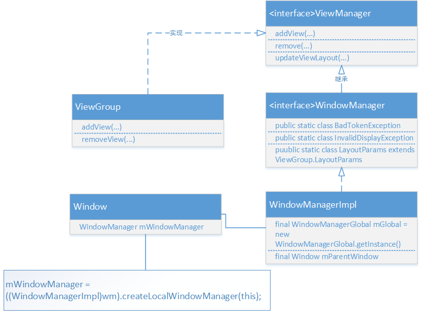
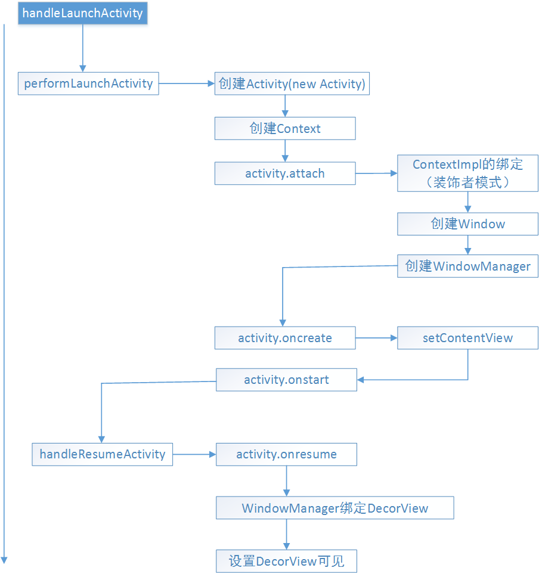

参考 http://www.jianshu.com/p/bac61386d9bf
http://dev.qq.com/topic/5923ef85bdc9739041a4a798

Window是一个窗口的概念，是一个抽象类，具体实现是PhoneWindow。
通过WindowManager来创建Window。
Window的具体实现位于WindowManagerService，WindowsManager和WindowMannagerService的交互是一个IPC的过程。

* WindowManager添加一个Window的过程
```java
Button button = new Button(this);
button.setText("button");
WindowManager.LayoutParams params = new WindowManager.LayoutParams(
        WindowManager.LayoutParams.WRAP_CONTENT,
        WindowManager.LayoutParams.WRAP_CONTENT,
        0, 0, PixelFormat.TRANSPARENT);
params.flags = WindowManager.LayoutParams.FLAG_NOT_FOCUSABLE
        | WindowManager.LayoutParams.FLAG_NOT_TOUCH_MODAL
        | WindowManager.LayoutParams.FLAG_SHOW_WHEN_LOCKED;
params.gravity = Gravity.LEFT | Gravity.TOP;
params.x = 100;
params.y = 300;
WindowManager windowManager = (WindowManager) getSystemService(WINDOW_SERVICE);
windowManager.addView(button, params);
```

* WindowManager.LayoutParams中的flag参数表示Window的属性，下面是几个比较常用的属性
表示window不需要获取焦点，也不需要接收各种输入事件。此标记会同时启用FLAG_NOT_TOUCH_MODAL，最终事件会直接传递给下层的具有焦点的window；

在此模式下，系统会将window区域外的单击事件传递给底层的window，当前window区域内的单击事件则自己处理，一般都需要开启这个标记；

开启此模式可以让Window显示在锁屏的界面上

* TYPE参数表示Window的类型，有三种，分别是应用Window，子Window和系统Window。

应用window对应着一个Activity，子window不能独立存在，需要附属在特定的父window之上，比如Dialog就是子window。系统window是需要声明权限才能创建的window，比如Toast和系统状态栏这些都是系统window，需要声明的权限是。

* window是分层的，每个window都对应着z-ordered，层级大的会覆盖在层级小的上面，应用window的层级范围是1~99，子window的层级范围是1000~1999，系统window的层级范围是2000~2999。
[注意，应用window的层级范围并不是1~999哟]

* WindowManager继承自ViewManager，常用的只有三个方法：addView、updateView和removeView。

# Android窗口结构
* 每一个Activity都包含一个Window对象，Window对象通常由PhoneWindow实现
* PhoneWindow：将Decoriew设置为整个应用窗口的根View。是Window的实现类。它是Android中的最基本的窗口系统，每个Activity 均会创建一个PhoneWindow对象，是Activity和整个View系统交互的接口。
* DecorView：顶层视图，将要显示的具体内容呈现在PhoneWindow上. DecorView是当前Activity所有View的祖先，它并不会向用户呈现任何东西，它主要有如下几个功能，可能不全：

1. Dispatch ViewRoot分发来的key、touch、trackball等外部事件；
2. DecorView有一个直接的子View，我们称之为System Layout,这个View是从系统的Layout.xml中解析出的，它包含当前UI的风格，如是否带title、是否带process bar等。可以称这些属性为Window decorations。
3. 作为PhoneWindow与ViewRoot之间的桥梁，ViewRoot通过DecorView设置窗口属性。//可以这样获取 View view = getWindow().getDecorView();
4. DecorView只有一个子元素为LinearLayout。代表整个Window界面，包含通知栏，标题栏，内容显示栏三块区域。DecorView里面TitleView：标题，可以设置requestWindowFeature(Window.FEATURE_NO_TITLE)取消掉ContentView：是一个id为content的FrameLayout。我们平常在Activity使用的setContentView就是设置在这里，也就是在FrameLayout上

# Window
```java
public abstract class Window {
        @Nullable public View findViewById(@IdRes int id) {
                return getDecorView().findViewById(id);
        }
}

public abst ract void setContentView(@LayoutRes int layoutResID);

public abstract void setContentView(View view);
```

Window是一个抽象基类，它提供了一系列窗口的方法，比如设置背景，标题等等，而它的唯一实现类则是PhoneWindow.
## [PhoneWindow](https://android.googlesource.com/platform/frameworks/base.git/+/b2a3dd88a53cc8c6d19f6dc8ec4f3d6c4abd9b54/core/java/android/view/ViewRoot.java)
```java
public class PhoneWindow extends Window implements MenuBuilder.Callback { 
        private final static String TAG = "PhoneWindow"; 
        ... 
        // This is the top-level view of the window, containing the window decor. 
        private DecorView mDecor; 
        // This is the view in which the window contents are placed. It is either 
        // mDecor itself, or a child of mDecor where the contents go. 
        private ViewGroup mContentParent; 
        private ViewGroup mContentRoot; 
        ... 
}
```
可以看到，在PhoneWindow里面，出现了成员变量DecorView的而这里，DecorView则是PhoneWindow里面的一个内部类，它是继承与FrameLayout
```java
private final class DecorView extends FrameLayout implements RootViewSurfaceTaker { 
        /* package */int mDefaultOpacity = PixelFormat.OPAQUE; 
        /** The feature ID of the panel, or -1 if this is the application's DecorView */ 
        private final int mFeatureId; 
        private final Rect mDrawingBounds = new Rect(); 
        private final Rect mBackgroundPadding = new Rect(); 
        private final Rect mFramePadding = new Rect(); 
        private final Rect mFrameOffsets = new Rect(); 
        .... 
}
```
既然是FrameLayout，也就可以加载布局文件，也就是说，我们那些标题栏，内容栏，顶级上看是加载在DecorView上的。而DecorView则是由PhoneWindow负责添加

## Activity.setContentView
```java
public void setContentView(@LayoutRes int layoutResID) {
        getWindow().setContentView(layoutResID);
        initWindowDecorActionBar();
}
```
里面方法调用了getWindow().setContentView，而这个getWindow方法获取的就是Activity上的mWindow.
如果当前mWindow为null的话，则表示当前Activity不在窗口上，这里的mWindow.setContentView，实际上调用到的是它的实现类方法phoneWindow.setContentView.

如果当前内容还未放置到窗口，此时mContentParent==null,也就是第一次调用的时候，调用那个installDecor方法。FEATURE_CONTENT_TRANSITIONS，则是标记当前内容加载有没有使用过度动画，也就是转场动画。如果内容已经加载过，并且不需要动画，则会调用removeAllViews。添加完Content后如有设置了FEATURE_CONTENT_TRANSITIONS则添加Scene来过度启动。否则`mLayoutInflater.inflate(layoutResID, mContentParent)`; 将我们的资源文件通过LayoutInflater对象转换为View树，并且添加至mContentParent视图中。既然是第一次启动则会调用到installDecor，从字面上看可以知道该方法用来添加DecorView，看下里面说明

```java
private void installDecor() { 
        if (mDecor == null) { 
                //调用该方法创建new一个DecorView 
                mDecor = generateDecor(); 
                mDecor.setDescendantFocusability(ViewGroup.FOCUS_AFTER_DESCENDANTS); 
                mDecor.setIsRootNamespace(true); 
                if (!mInvalidatePanelMenuPosted && mInvalidatePanelMenuFeatures != 0) { 
                        mDecor.postOnAnimation(mInvalidatePanelMenuRunnable); 
                } 
        } 
        //一开始DecorView未加载到mContentParent，所以此时mContentParent=null 
        if (mContentParent == null) { 
                //该方法将mDecorView添加到Window上绑定布局 
                mContentParent = generateLayout(mDecor); 
                // Set up decor part of UI to ignore fitsSystemWindows if appropriate. 
                mDecor.makeOptionalFitsSystemWindows(); 
                final DecorContentParent decorContentParent = (DecorContentParent) mDecor.findViewById( R.id.decor_content_parent); 
                ...//添加其他资源 
                ...//设置转场动画 
        } 
}

protected DecorView generateDecor() {
        return new DecorView(getContext(), -1);
}
```
创建完后再通过调用generateLayout将setContentView的内容赋值到mContentParent，这个方法有点长，我们看下
```java
protected ViewGroup generateLayout(DecorView decor) { 
        // Apply data from current theme. 
        //根据当前设置的主题来加载默认布局 
        TypedArray a = getWindowStyle(); 
        //如果你在theme中设置了window_windowNoTitle，则这里会调用到，其他方法同理， 
        //这里是根据你在theme中的设置去设置的 
        if (a.getBoolean(R.styleable.Window_windowNoTitle, false)) { 
                requestFeature(FEATURE_NO_TITLE); 
        } else if (a.getBoolean(R.styleable.Window_windowActionBar, false)) { 
                // Don't allow an action bar if there is no title. 
                requestFeature(FEATURE_ACTION_BAR); 
        } 
        //是否有设置全屏 
        if (a.getBoolean(R.styleable.Window_windowFullscreen, false)) { 
                setFlags(FLAG_FULLSCREEN, FLAG_FULLSCREEN & (~getForcedWindowFlags())); 
        } 
        ...
        //省略其他加载资源 
        // 添加布局到DecorView，前面说到，DecorView是继承与FrameLayout，它本身也是一个ViewGroup，而我们前面创建它的时候，只是调用了new DecorView，此时里面并无什么东西。而下面的步奏则是根据用户设置的Feature来创建相应的默认布局主题。举个例子，如果我在setContentView之前调用了requestWindowFeature(Window.FEATURE_NO_TITLE)，这里则会通过getLocalFeatures来获取你设置的feature，进而选择加载对应的布局，此时则是加载没有标题栏的主题，对应的就是R.layout.screen_simple 
        int layoutResource; 
        int features = getLocalFeatures(); 
        // System.out.println("Features: 0x" + Integer.toHexString(features)); 
        if ((features & (1 << FEATURE_SWIPE_TO_DISMISS)) != 0) { 
                layoutResource = R.layout.screen_swipe_dismiss; 
        } 
        ... //省略其他判断方法 
        } else { 
                // Embedded, so no decoration is needed. 
                layoutResource = R.layout.screen_simple; 
                // System.out.println("Simple!"); 
        } 
        mDecor.startChanging(); 
        //选择对应布局创建添加到DecorView中 
        View in = mLayoutInflater.inflate(layoutResource, null); 
        decor.addView(in, new ViewGroup.LayoutParams(MATCH_PARENT, MATCH_PARENT)); 
        mContentRoot = (ViewGroup) in; 
        ViewGroup contentParent = (ViewGroup)findViewById(ID_ANDROID_CONTENT); 
        ... 
        return contentParent; 
}
```
首先generateLayout会根据当前用户设置的主题去设置对应的Feature，接着，根据对应的Feature来选择加载对应的布局文件，(Window.FEATURE_NO_TITLE)接下来通过getLocalFeatures来获取你设置的feature，进而选择加载对应的布局，这也就是为什么我们要在setContentView之前调用requesetFeature的原因。此时则是加载没有标题栏的主题，对应的就是R.layout.screen_simple

* Window是一个抽象类，提供了各种窗口操作的方法，比如设置背景标题ContentView等等
* PhoneWindow则是Window的唯一实现类，它里面实现了各种添加背景主题ContentView的方法，内部通过DecorView来添加顶级视图
* 每一个Activity上面都有一个Window，可以通过getWindow获取
* DecorView，顶级视图，继承于FramentLayout，setContentView则是添加在它里面的@id/content里
* setContentView里面创建了DecorView，根据Theme，Feature添加了对应的布局文件
* 当setContentView设置显示后会回调Activity的onContentChanged方法


<div align=center>

</div>

## ViewManager.class
```java
public interface ViewManager{ 
        public void addView(View view, ViewGroup.LayoutParams params); 
        public void updateViewLayout(View view, ViewGroup.LayoutParams params); 
        public void removeView(View view); 
}
```
我们看下ViewManager的实现类
```java
public abstract class ViewGroup extends View implements ViewParent, ViewManager {
    public void addView(View child, LayoutParams params) {
        addView(child, -1, params);
    }

    /**
     * Adds a child view with the specified layout parameters.
     *
     * <p><strong>Note:</strong> do not invoke this method from
     * {@link #draw(android.graphics.Canvas)}, {@link #onDraw(android.graphics.Canvas)},
     * {@link #dispatchDraw(android.graphics.Canvas)} or any related method.</p>
     *
     * @param child the child view to add
     * @param index the position at which to add the child or -1 to add last
     * @param params the layout parameters to set on the child
     */
    public void addView(View child, int index, LayoutParams params) {
        if (DBG) {
            System.out.println(this + " addView");
        }

        if (child == null) {
            throw new IllegalArgumentException("Cannot add a null child view to a ViewGroup");
        }

        // addViewInner() will call child.requestLayout() when setting the new LayoutParams
        // therefore, we call requestLayout() on ourselves before, so that the child's request
        // will be blocked at our level
        requestLayout();
        invalidate(true);
        addViewInner(child, index, params, false);
    }
}
```

## WindowManager
```java
/*   The interface that apps use to talk to the window manager.
Use Context.getSystemService(Context.WINDOW_SERVICE) to get one of these.
*/ 
public interface WindowManager extends ViewManager { 
        public static class BadTokenException extends RuntimeException{...} 
        public static class InvalidDisplayException extends RuntimeException{...} 
        public Display getDefaultDisplay()；
        public void removeViewImmediate(View view); 
        public static class LayoutParams extends ViewGroup.LayoutParams implements Parcelable{};
```

可以看到WindowManager是一个接口，而且它继承与ViewManager。WindowManager字面理解就是窗口管理器，每一个窗口管理器都与一个的窗口显示绑定。获取实例可以通过
Context.getSystemService(Context.WINDOW_SERVICE)获取。既然继承了ViewManager，那么它也就可以进行添加删除View的操作了，不过它的操作放在它的实现类WindowManagerImpl里面。成员变量里面

* BadTokenException：则是addView时它的LayoutParams无效则会被抛出，或是添加第二个View的时候没有移除第一个View则会被抛出
* InvalidDisplayException：如果一个窗口是在一个二级的显示上而指定的显示找不到则会被抛出
* getDefaultDisplay：返回当前WindowManager管理的显示Display
* removeViewImmediate：表示从窗口上移除View，一般是当View调用了onDetachedFromWindow也就是从Window上分开后，把它移除。
* LayoutParams：静态内部类。显然是Window的布局参数，里面定义了一系列的窗口属性。

## WindowManagerImpl
```java
public final class WindowManagerImpl implements WindowManager { 
        private final WindowManagerGlobal mGlobal = WindowManagerGlobal.getInstance(); 
        private final Display mDisplay; 
        private final Window mParentWindow; 
        
        @Override 
        public void addView(@NonNull View view, @NonNull ViewGroup.LayoutParams params) { 
                applyDefaultToken(params); 
                mGlobal.addView(view, params, mDisplay, mParentWindow); 
        } 
        
        ... 
        @Override 
        public void removeView(View view) { 
                mGlobal.removeView(view, false); 
        }
}
```
可以看到WindowManagerImpl里面有一个成员变量WindowManagerGlobal，而真正的实现则是在WindowManagerGlobal了，类似代理，只不过WindowManagerGlobal是个没有实现WindowManager的类的，自己定义了套实现。

```java
public final class WindowManagerGlobal { 
        private static final String TAG = "WindowManager"; 
        public void addView(View view, ViewGroup.LayoutParams params, Display display, 
                Window parentWindow { 
                ...
        } 
}
```

## 联系
对于Activity的启动过程，是有两种，一种是点击程序进入启动的Activity，另一种而是在已有的Activity中调用startActivity，启动期间通过Binder驱动ActivityWindowService，ActivityThread,ApplicationThread，ActivityStack ，Activity之间进行通信，为当前Activity创建进程分配任务栈后启动Activity。这里就跳过前面很多步骤，直接到了ActivityThread.handleLaunchActivity去查看Activity的创建
```java
    private void handleLaunchActivity(ActivityClientRecord r, Intent customIntent, String reason) {
        ...
        // Initialize before creating the activity
        WindowManagerGlobal.initialize();
        Activity a = performLaunchActivity(r, customIntent);
        if (a != null) {
            r.createdConfig = new Configuration(mConfiguration);
            reportSizeConfigurations(r);
            Bundle oldState = r.state;
            handleResumeActivity(r.token, false, r.isForward,
                    !r.activity.mFinished && !r.startsNotResumed, r.lastProcessedSeq, reason);
            if (!r.activity.mFinished && r.startsNotResumed) {
                // The activity manager actually wants this one to start out paused, because it
                // needs to be visible but isn't in the foreground. We accomplish this by going
                // through the normal startup (because activities expect to go through onResume()
                // the first time they run, before their window is displayed), and then pausing it.
                // However, in this case we do -not- need to do the full pause cycle (of freezing
                // and such) because the activity manager assumes it can just retain the current
                // state it has.
                performPauseActivityIfNeeded(r, reason);
                // We need to keep around the original state, in case we need to be created again.
                // But we only do this for pre-Honeycomb apps, which always save their state when
                // pausing, so we can not have them save their state when restarting from a paused
                // state. For HC and later, we want to (and can) let the state be saved as the
                // normal part of stopping the activity.
                if (r.isPreHoneycomb()) {
                    r.state = oldState;
                }
            }
        } else {
            // If there was an error, for any reason, tell the activity manager to stop us.
            try {
                ActivityManager.getService()
                    .finishActivity(r.token, Activity.RESULT_CANCELED, null,
                            Activity.DONT_FINISH_TASK_WITH_ACTIVITY);
            } catch (RemoteException ex) {
                throw ex.rethrowFromSystemServer();
            }
        }
    }
```

可以看到 WindowManagerGlobal.initialize()则通过WindowManagerGlobal创建了WindowManagerServer，接下来调用了performLaunchActivity
```java
private Activity performLaunchActivity(ActivityClientRecord r, Intent customIntent) {
        ... 
        Activity activity = null; 
        try { 
                 //Activity通过ClassLoader创建出来 
                 java.lang.ClassLoader cl = r.packageInfo.getClassLoader(); 
                 activity = mInstrumentation.newActivity( cl, component.getClassName(), r.intent); 
        } 
        ... 
        try { 
                //创建Application 
                Application app = r.packageInfo.makeApplication(false, mInstrumentation); 
                ... 
                if (activity != null) { 
                        //创建Activity所需的Context 
                        Context appContext = createBaseContextForActivity(r, activity); 
                        ... 
                        //将Context与Activity进行绑定 
                        activity.attach(appContext, this, getInstrumentation(), r.token, r.ident, app, r.intent, r.activityInfo, title, r.parent, r.embeddedID, r.lastNonConfigurationInstances, config, r.referrer, r.voiceInteractor); 
                        ... 
                        //调用activity.oncreate 
                        mInstrumentation.callActivityOnCreate(activity, r.state, r.persistentState); 
                        ... 
                        //调用Activity的onstart方法 
                        activity.performStart(); 
                        //调用activitu的OnRestoreInstanceState方法进行Window数据恢复 
                        mInstrumentation.callActivityOnRestoreInstanceState(activity, r.state r.persistentState); 
                        ... 
        
        return activity; 
}
```
先通过调用 activity = mInstrumentation.newActivity创建Activity，可以看到里面是通过ClassLoader来加载的
```java
public Activity newActivity(ClassLoader cl, String className, Intent intent)
            throws InstantiationException, IllegalAccessException, ClassNotFoundException { 
        return (Activity)cl.loadClass(className).newInstance(); 
}
```

<div align=center>

</div>

* ViewManager接口定义了一组规则，也就是add、update、remove的操作View接口。ViewGroup实现了该接口
* WindowManager的实现类是WindowManagerImpl，而它则是通过WindowManagerGlobal代理实现。WindowManager用来在应用与Window之间的接口、窗口顺序、消息等的管理

## WindowManagerGlobal.class
```java
public void addView(View view, ViewGroup.LayoutParams params,
            Display display, Window parentWindow) { 
        ... 
        ViewRootImpl root; 
        View panelParentView = null; 
        ... 
        root = new ViewRootImpl(view.getContext(), display); 
        view.setLayoutParams(wparams); 
        mViews.add(view); 
        mRoots.add(root); 
        mParams.add(wparams); 
        //ViewRootImpl开始绘制view 
        root.setView(view, wparams, panelParentView); 
        ... 
}
```
可以看到在WindowManagerGlobal的addView中，最后是调用了ViewRootImpl的add方法，那么这个ViewRootImpl到底是什么。
## ViewRootImpl.class
看到ViewRootImpl想到可能会有ViewRoot类，但是看了源码才知道，ViewRoot类在Android2.2之后就被ViewRootImpl替换了。我们看下说明
```java
/* The top of a view hierarchy, implementing the needed protocol between View * and the WindowManager. This is for the most part an internal implementation * detail of {@link WindowManagerGlobal}. */
```

ViewRootImpl是一个视图层次结构的顶部，它实现了View与WindowManager之间所需要的协议，作为WindowManagerGlobal中大部分的内部实现。这个好理解，在WindowManagerGlobal中实现方法中，都可以见到ViewRootImpl，也就说WindowManagerGlobal方法最后还是调用到了ViewRootImpl。addView,removeView,update调用顺序
```java
WindowManagerImpl -> WindowManagerGlobal -> ViewRootImpl
```
看下前面调用到了viewRootImpl的setView方法
```java
public void setView(View view, WindowManager.LayoutParams attrs, View panelParentView) { 
        ... 
        // Schedule the first layout -before- adding to the window  
        // manager, to make sure we do the relayout before receiving  
        // any other events from the system. 
        requestLayout(); 
        ... 
        try { 
                ... 
                res = mWindowSession.addToDisplay(mWindow, mSeq, mWindowAttributes, getHostVisibility(), mDisplay.getDisplayId(), mAttachInfo.mContentInsets, mAttachInfo.mStableInsets, mAttachInfo.mOutsets, mInputChannel); 
        } 
}
```
在setView方法中，
首先会调用到requestLayout()，表示添加Window之前先完成第一次layout布局过程，以确保在收到任何系统事件后面重新布局。requestLayout最终会调用performTraversals方法来完成View的绘制。

接着会通过WindowSession最终来完成Window的添加过程。在下面的代码中mWindowSession类型是IWindowSession，它是一个Binder对象，真正的实现类是Session，也就是说这其实是一次IPC过程，远程调用了Session中的addToDisPlay方法。

```java
@Override public int addToDisplay(IWindow window, int seq, WindowManager.LayoutParams attrs,
            int viewVisibility, int displayId, Rect outContentInsets, Rect outStableInsets,
            Rect outOutsets, InputChannel outInputChannel) { 
        return mService.addWindow(this, window, seq, attrs, viewVisibility, displayId, outContentInsets, outStableInsets, outOutsets, outInputChannel); 
}
```
这里的mService就是WindowManagerService，也就是说Window的添加请求，最终是通过WindowManagerService来添加的。

## View通过ViewRootImpl来绘制
前面说到，ViewRootImpl调用到requestLayout()来完成View的绘制操作，我们看下源码
```java
    @Override
    public void requestLayout() {
        if (!mHandlingLayoutInLayoutRequest) {
            checkThread(); // 先判断当前线程, 不是主线程的话，抛出异常 android.view.ViewRootImpl$CalledFromWrongThreadException: Only the original thread that created a view hierarchy can touch its views.
            mLayoutRequested = true;
            scheduleTraversals();
        }
    }

    void scheduleTraversals() { 
        if (!mTraversalScheduled) { 
                ... 
                mChoreographer.postCallback( Choreographer.CALLBACK_TRAVERSAL, mTraversalRunnable, null); 
                ... 
        } 
        }
```
scheduleTraversals中会通过handler去异步调用mTraversalRunnable接口
```java
final class TraversalRunnable implements Runnable {
        @Override
        public void run() {
            doTraversal();
        }
}

void doTraversal() {
        ...
        performTraversals();
        ...
}
```
可以看到，最后真正调用绘制的是performTraversals（）方法，这个方法很长核心便是
```java
private void performTraversals() { 
        ... 
        performMeasure(childWidthMeasureSpec, childHeightMeasureSpec); 
        ... 
        performLayout(lp, desiredWindowWidth, desiredWindowHeight); 
        ... 
        performDraw(); 
} 
```

## View与WindowManager联系

* 之所以说ViewRoot是View和WindowManager的桥梁，是因为在真正操控绘制View的是ViewRootImpl，View通过WindowManager来转接调用ViewRootImpl
* 在ViewRootImpl未初始化创建的时候是可以进行子线程更新UI的，而它创建是在activity.handleResumeActivity方法调用，即DecorView被添加到WindowManager的时候
* ViewRootImpl绘制View的时候会先检查当前线程是否是主线程，是才能继续绘制下去

## WindowManager.LayoutParams
```java
public static class LayoutParams extends ViewGroup.LayoutParams
            implements Parcelable { 
        //窗口的绝对XY位置，需要考虑gravity属性 
        public int x; public int y; 
        //在横纵方向上为相关的View预留多少扩展像素，如果是0则此view不能被拉伸，其他情况下扩展像素被widget均分 
        public float horizontalWeight; public float verticalWeight; 
        //窗口类型 
        //有3种主要类型如下： 
        //ApplicationWindows取值在FIRST_APPLICATION_WINDOW与LAST_APPLICATION_WINDOW之间，是常用的顶层应用程序窗口，须将token设置成Activity的token； 
        //SubWindows取值在FIRST_SUB_WINDOW和LAST_SUB_WINDOW之间，与顶层窗口相关联，需将token设置成它所附着宿主窗口的token； 
        //SystemWindows取值在FIRST_SYSTEM_WINDOW和LAST_SYSTEM_WINDOW之间，不能用于应用程序，使用时需要有特殊权限，它是特定的系统功能才能使用； 
        public int type; 
        //WindowType：开始应用程序窗口 
        public static final int FIRST_APPLICATION_WINDOW = 1; 
        //WindowType：所有程序窗口的base窗口，其他应用程序窗口都显示在它上面 
        public static final int TYPE_BASE_APPLICATION = 1; 
        //WindowType：普通应用程序窗口，token必须设置为Activity的token来指定窗口属于谁 
        public static final int TYPE_APPLICATION = 2; 
        //WindowType：应用程序启动时所显示的窗口，应用自己不要使用这种类型，它被系统用来显示一些信息，直到应用程序可以开启自己的窗口为止 
        public static final int TYPE_APPLICATION_STARTING = 3; 
        //WindowType：结束应用程序窗口 
        public static final int LAST_APPLICATION_WINDOW = 99; 
        //WindowType：SubWindows子窗口，子窗口的Z序和坐标空间都依赖于他们的宿主窗口 
        public static final int FIRST_SUB_WINDOW = 1000; 
        //WindowType： 面板窗口，显示于宿主窗口的上层 
        public static final int TYPE_APPLICATION_PANEL = FIRST_SUB_WINDOW; 
        //WindowType：媒体窗口（例如视频），显示于宿主窗口下层 
        public static final int TYPE_APPLICATION_MEDIA = FIRST_SUB_WINDOW+1; 
        //WindowType：应用程序窗口的子面板，显示于所有面板窗口的上层 
        public static final int TYPE_APPLICATION_SUB_PANEL = FIRST_SUB_WINDOW+2; 
        //WindowType：对话框，类似于面板窗口，绘制类似于顶层窗口，而不是宿主的子窗口 
        public static final int TYPE_APPLICATION_ATTACHED_DIALOG = FIRST_SUB_WINDOW+3; 
        //WindowType：媒体信息，显示在媒体层和程序窗口之间，需要实现半透明效果 
        public static final int TYPE_APPLICATION_MEDIA_OVERLAY = FIRST_SUB_WINDOW+4; 
        //WindowType：子窗口结束 
        public static final int LAST_SUB_WINDOW = 1999; 
        //WindowType：系统窗口，非应用程序创建 
        public static final int FIRST_SYSTEM_WINDOW = 2000; 
        //WindowType：状态栏，只能有一个状态栏，位于屏幕顶端，其他窗口都位于它下方 
        public static final int TYPE_STATUS_BAR = FIRST_SYSTEM_WINDOW; 
        //WindowType：搜索栏，只能有一个搜索栏，位于屏幕上方 
        public static final int TYPE_SEARCH_BAR = FIRST_SYSTEM_WINDOW+1; 
        //WindowType：电话窗口，它用于电话交互（特别是呼入），置于所有应用程序之上，状态栏之下 
        public static final int TYPE_PHONE = FIRST_SYSTEM_WINDOW+2; 
        //WindowType：系统提示，出现在应用程序窗口之上 
        public static final int TYPE_SYSTEM_ALERT = FIRST_SYSTEM_WINDOW+3; 
        //WindowType：锁屏窗口 
        public static final int TYPE_KEYGUARD = FIRST_SYSTEM_WINDOW+4; 
        //WindowType：信息窗口，用于显示Toast 
        public static final int TYPE_TOAST = FIRST_SYSTEM_WINDOW+5; 
        //WindowType：系统顶层窗口，显示在其他一切内容之上，此窗口不能获得输入焦点，否则影响锁屏 
        public static final int TYPE_SYSTEM_OVERLAY = FIRST_SYSTEM_WINDOW+6; 
        //WindowType：电话优先，当锁屏时显示，此窗口不能获得输入焦点，否则影响锁屏 
        public static final int TYPE_PRIORITY_PHONE = FIRST_SYSTEM_WINDOW+7; 
        //WindowType：系统对话框 
        public static final int TYPE_SYSTEM_DIALOG = FIRST_SYSTEM_WINDOW+8; 
        //WindowType：锁屏时显示的对话框 
        public static final int TYPE_KEYGUARD_DIALOG = FIRST_SYSTEM_WINDOW+9; 
        //WindowType：系统内部错误提示，显示于所有内容之上 
        public static final int TYPE_SYSTEM_ERROR = FIRST_SYSTEM_WINDOW+10; 
        //WindowType：内部输入法窗口，显示于普通UI之上，应用程序可重新布局以免被此窗口覆盖 
        public static final int TYPE_INPUT_METHOD = FIRST_SYSTEM_WINDOW+11; 
        //WindowType：内部输入法对话框，显示于当前输入法窗口之上 
        public static final int TYPE_INPUT_METHOD_DIALOG= FIRST_SYSTEM_WINDOW+12; 
        //WindowType：墙纸窗口 
        public static final int TYPE_WALLPAPER = FIRST_SYSTEM_WINDOW+13; 
        //WindowType：状态栏的滑动面板 
        public static final int TYPE_STATUS_BAR_PANEL = FIRST_SYSTEM_WINDOW+14; 
        //WindowType：安全系统覆盖窗口，这些窗户必须不带输入焦点，否则会干扰键盘 
        public static final int TYPE_SECURE_SYSTEM_OVERLAY = FIRST_SYSTEM_WINDOW+15; 
        //WindowType：拖放伪窗口，只有一个阻力层(最多)，它被放置在所有其他窗口上面 
        public static final int TYPE_DRAG = FIRST_SYSTEM_WINDOW+16; 
        //WindowType：状态栏下拉面板 
        public static final int TYPE_STATUS_BAR_SUB_PANEL = FIRST_SYSTEM_WINDOW+17; 
        //WindowType：鼠标指针 
        public static final int TYPE_POINTER = FIRST_SYSTEM_WINDOW+18; 
        //WindowType：导航栏(有别于状态栏时) 
        public static final int TYPE_NAVIGATION_BAR = FIRST_SYSTEM_WINDOW+19; 
        //WindowType：音量级别的覆盖对话框，显示当用户更改系统音量大小 
        public static final int TYPE_VOLUME_OVERLAY = FIRST_SYSTEM_WINDOW+20; 
        //WindowType：起机进度框，在一切之上 
        public static final int TYPE_BOOT_PROGRESS = FIRST_SYSTEM_WINDOW+21; 
        //WindowType：假窗，消费导航栏隐藏时触摸事件 
        public static final int TYPE_HIDDEN_NAV_CONSUMER = FIRST_SYSTEM_WINDOW+22; 
        //WindowType：梦想(屏保)窗口，略高于键盘 
        public static final int TYPE_DREAM = FIRST_SYSTEM_WINDOW+23; 
        //WindowType：导航栏面板(不同于状态栏的导航栏) 
        public static final int TYPE_NAVIGATION_BAR_PANEL = FIRST_SYSTEM_WINDOW+24; 
        //WindowType：universe背后真正的窗户 
        public static final int TYPE_UNIVERSE_BACKGROUND = FIRST_SYSTEM_WINDOW+25; 
        //WindowType：显示窗口覆盖，用于模拟辅助显示设备 
        public static final int TYPE_DISPLAY_OVERLAY = FIRST_SYSTEM_WINDOW+26; 
        //WindowType：放大窗口覆盖，用于突出显示的放大部分可访问性放大时启用 
        public static final int TYPE_MAGNIFICATION_OVERLAY = FIRST_SYSTEM_WINDOW+27; 
        //WindowType：...... 
        public static final int TYPE_KEYGUARD_SCRIM = FIRST_SYSTEM_WINDOW+29; 
        public static final int TYPE_PRIVATE_PRESENTATION = FIRST_SYSTEM_WINDOW+30; 
        public static final int TYPE_VOICE_INTERACTION = FIRST_SYSTEM_WINDOW+31; 
        public static final int TYPE_ACCESSIBILITY_OVERLAY = FIRST_SYSTEM_WINDOW+32; 
        //WindowType：系统窗口结束 
        public static final int LAST_SYSTEM_WINDOW = 2999; 
        //MemoryType：窗口缓冲位于主内存 
        public static final int MEMORY_TYPE_NORMAL = 0; 
        //MemoryType：窗口缓冲位于可以被DMA访问，或者硬件加速的内存区域 
        public static final int MEMORY_TYPE_HARDWARE = 1; 
        //MemoryType：窗口缓冲位于可被图形加速器访问的区域 
        public static final int MEMORY_TYPE_GPU = 2; 
        //MemoryType：窗口缓冲不拥有自己的缓冲区，不能被锁定，缓冲区由本地方法提供 
        public static final int MEMORY_TYPE_PUSH_BUFFERS = 3; 
        //指出窗口所使用的内存缓冲类型，默认为NORMAL 
        public int memoryType; 
        //Flag：当该window对用户可见的时候，允许锁屏 
        public static final int FLAG_ALLOW_LOCK_WHILE_SCREEN_ON = 0x00000001; 
        //Flag：让该window后所有的东西都成暗淡 
        public static final int FLAG_DIM_BEHIND = 0x00000002; 
        //Flag：让该window后所有东西都模糊（4.0以上已经放弃这种毛玻璃效果） 
        public static final int FLAG_BLUR_BEHIND = 0x00000004; 
        //Flag：让window不能获得焦点，这样用户快就不能向该window发送按键事 
        public static final int FLAG_NOT_FOCUSABLE = 0x00000008; 
        //Flag：让该window不接受触摸屏事件 
        public static final int FLAG_NOT_TOUCHABLE = 0x00000010; 
        //Flag：即使在该window在可获得焦点情况下，依旧把该window之外的任何event发送到该window之后的其他window 
        public static final int FLAG_NOT_TOUCH_MODAL = 0x00000020; 
        //Flag：当手机处于睡眠状态时，如果屏幕被按下，那么该window将第一个收到 
        public static final int FLAG_TOUCHABLE_WHEN_WAKING = 0x00000040; 
        //Flag：当该window对用户可见时，让设备屏幕处于高亮（bright）状态 
        public static final int FLAG_KEEP_SCREEN_ON = 0x00000080; 
        //Flag：让window占满整个手机屏幕，不留任何边界 
        public static final int FLAG_LAYOUT_IN_SCREEN = 0x00000100; 
        //Flag：window大小不再不受手机屏幕大小限制，即window可能超出屏幕之外 
        public static final int FLAG_LAYOUT_NO_LIMITS = 0x00000200; 
        //Flag：window全屏显示 
        public static final int FLAG_FULLSCREEN = 0x00000400; 
        //Flag：恢复window非全屏显示 
        public static final int FLAG_FORCE_NOT_FULLSCREEN = 0x00000800; 
        //Flag：开启抖动（dithering） 
        public static final int FLAG_DITHER = 0x00001000; 
        //Flag：当该window在进行显示的时候，不允许截屏 
        public static final int FLAG_SECURE = 0x00002000; 
        //Flag：一个特殊模式的布局参数用于执行扩展表面合成时到屏幕上 
        public static final int FLAG_SCALED = 0x00004000; 
        //Flag：用于windows时,经常会使用屏幕用户持有反对他们的脸,它将积极过滤事件流,以防止意外按在这种情况下,可能不需要为特定的窗口,在检测到这样一个事件流时,应用程序将接收取消运动事件表明,这样应用程序可以处理这相应地采取任何行动的事件,直到手指释放 
        public static final int FLAG_IGNORE_CHEEK_PRESSES = 0x00008000; 
        //Flag：一个特殊的选项只用于结合FLAG_LAYOUT_IN_SC 
        public static final int FLAG_LAYOUT_INSET_DECOR = 0x00010000; 
        //Flag：转化的状态FLAG_NOT_FOCUSABLE对这个窗口当前如何进行交互的方法 
        public static final int FLAG_ALT_FOCUSABLE_IM = 0x00020000; 
        //Flag：如果你设置了该flag,那么在你FLAG_NOT_TOUNCH_MODAL的情况下，即使触摸屏事件发送在该window之外，其事件被发送到了后面的window,那么该window仍然将以MotionEvent.ACTION_OUTSIDE形式收到该触摸屏事件 
        public static final int FLAG_WATCH_OUTSIDE_TOUCH = 0x00040000; 
        //Flag：当锁屏的时候，显示该window public static final int FLAG_SHOW_WHEN_LOCKED = 0x00080000; //Flag：在该window后显示系统的墙纸 public static final int FLAG_SHOW_WALLPAPER = 0x00100000; //Flag：当window被显示的时候，系统将把它当做一个用户活动事件，以点亮手机屏幕 public static final int FLAG_TURN_SCREEN_ON = 0x00200000; //Flag：消失键盘 public static final int FLAG_DISMISS_KEYGUARD = 0x00400000; //Flag：当该window在可以接受触摸屏情况下，让因在该window之外，而发送到后面的window的触摸屏可以支持split touch public static final int FLAG_SPLIT_TOUCH = 0x00800000; //Flag：对该window进行硬件加速，该flag必须在Activity或Dialog的Content View之前进行设置 public static final int FLAG_HARDWARE_ACCELERATED = 0x01000000; //Flag：让window占满整个手机屏幕，不留任何边界 public static final int FLAG_LAYOUT_IN_OVERSCAN = 0x02000000; //Flag：请求一个半透明的状态栏背景以最小的系统提供保护 public static final int FLAG_TRANSLUCENT_STATUS = 0x04000000; //Flag：请求一个半透明的导航栏背景以最小的系统提供保护 public static final int FLAG_TRANSLUCENT_NAVIGATION = 0x08000000; //Flag：...... public static final int FLAG_LOCAL_FOCUS_MODE = 0x10000000; public static final int FLAG_SLIPPERY = 0x20000000; public static final int FLAG_LAYOUT_ATTACHED_IN_DECOR = 0x40000000; public static final int FLAG_DRAWS_SYSTEM_BAR_BACKGROUNDS = 0x80000000; //行为选项标记 public int flags; //PrivateFlags：...... public static final int PRIVATE_FLAG_FAKE_HARDWARE_ACCELERATED = 0x00000001; public static final int PRIVATE_FLAG_FORCE_HARDWARE_ACCELERATED = 0x00000002; public static final int PRIVATE_FLAG_WANTS_OFFSET_NOTIFICATIONS = 0x00000004; public static final int PRIVATE_FLAG_SHOW_FOR_ALL_USERS = 0x00000010; public static final int PRIVATE_FLAG_NO_MOVE_ANIMATION = 0x00000040; public static final int PRIVATE_FLAG_COMPATIBLE_WINDOW = 0x00000080; public static final int PRIVATE_FLAG_SYSTEM_ERROR = 0x00000100; public static final int PRIVATE_FLAG_INHERIT_TRANSLUCENT_DECOR = 0x00000200; public static final int PRIVATE_FLAG_KEYGUARD = 0x00000400; public static final int PRIVATE_FLAG_DISABLE_WALLPAPER_TOUCH_EVENTS = 0x00000800; //私有的行为选项标记 public int privateFlags; public static final int NEEDS_MENU_UNSET = 0; public static final int NEEDS_MENU_SET_TRUE = 1; public static final int NEEDS_MENU_SET_FALSE = 2; public int needsMenuKey = NEEDS_MENU_UNSET; public static boolean mayUseInputMethod(int flags) { ...... } //SOFT_INPUT：用于描述软键盘显示规则的bite的mask public static final int SOFT_INPUT_MASK_STATE = 0x0f; //SOFT_INPUT：没有软键盘显示的约定规则 public static final int SOFT_INPUT_STATE_UNSPECIFIED = 0; //SOFT_INPUT：可见性状态softInputMode，请不要改变软输入区域的状态 public static final int SOFT_INPUT_STATE_UNCHANGED = 1; //SOFT_INPUT：用户导航（navigate）到你的窗口时隐藏软键盘 public static final int SOFT_INPUT_STATE_HIDDEN = 2; //SOFT_INPUT：总是隐藏软键盘 public static final int SOFT_INPUT_STATE_ALWAYS_HIDDEN = 3; //SOFT_INPUT：用户导航（navigate）到你的窗口时显示软键盘 public static final int SOFT_INPUT_STATE_VISIBLE = 4; //SOFT_INPUT：总是显示软键盘 public static final int SOFT_INPUT_STATE_ALWAYS_VISIBLE = 5; //SOFT_INPUT：显示软键盘时用于表示window调整方式的bite的mask public static final int SOFT_INPUT_MASK_ADJUST = 0xf0; //SOFT_INPUT：不指定显示软件盘时，window的调整方式 public static final int SOFT_INPUT_ADJUST_UNSPECIFIED = 0x00; //SOFT_INPUT：当显示软键盘时，调整window内的控件大小以便显示软键盘 public static final int SOFT_INPUT_ADJUST_RESIZE = 0x10; //SOFT_INPUT：当显示软键盘时，调整window的空白区域来显示软键盘，即使调整空白区域，软键盘还是有可能遮挡一些有内容区域，这时用户就只有退出软键盘才能看到这些被遮挡区域并进行 public static final int SOFT_INPUT_ADJUST_PAN = 0x20; //SOFT_INPUT：当显示软键盘时，不调整window的布局 public static final int SOFT_INPUT_ADJUST_NOTHING = 0x30; //SOFT_INPUT：用户导航（navigate）到了你的window public static final int SOFT_INPUT_IS_FORWARD_NAVIGATION = 0x100; //软输入法模式选项 public int softInputMode; //窗口如何停靠 public int gravity; //水平边距，容器与widget之间的距离，占容器宽度的百分率 public float horizontalMargin; //纵向边距 public float verticalMargin; //积极的insets绘图表面和窗口之间的内容 public final Rect surfaceInsets = new Rect(); //期望的位图格式，默认为不透明，参考android.graphics.PixelFormat public int format; //窗口所使用的动画设置，它必须是一个系统资源而不是应用程序资源，因为窗口管理器不能访问应用程序 public int windowAnimations; //整个窗口的半透明值，1.0表示不透明，0.0表示全透明 public float alpha = 1.0f; //当FLAG_DIM_BEHIND设置后生效，该变量指示后面的窗口变暗的程度，1.0表示完全不透明，0.0表示没有变暗 public float dimAmount = 1.0f; public static final float BRIGHTNESS_OVERRIDE_NONE = -1.0f; public static final float BRIGHTNESS_OVERRIDE_OFF = 0.0f; public static final float BRIGHTNESS_OVERRIDE_FULL = 1.0f; public float screenBrightness = BRIGHTNESS_OVERRIDE_NONE; //用来覆盖用户设置的屏幕亮度，表示应用用户设置的屏幕亮度，从0到1调整亮度从暗到最亮发生变化 public float buttonBrightness = BRIGHTNESS_OVERRIDE_NONE; public static final int ROTATION_ANIMATION_ROTATE = 0; public static final int ROTATION_ANIMATION_CROSSFADE = 1; public static final int ROTATION_ANIMATION_JUMPCUT = 2; //定义出入境动画在这个窗口旋转设备时使用 public int rotationAnimation = ROTATION_ANIMATION_ROTATE; //窗口的标示符 public IBinder token = null; //此窗口所在的包名 public String packageName = null; //屏幕方向 public int screenOrientation = ActivityInfo.SCREEN_ORIENTATION_UNSPECIFIED; //首选的刷新率的窗口 public float preferredRefreshRate; //控制status bar是否显示 public int systemUiVisibility; //ui能见度所请求的视图层次结构 public int subtreeSystemUiVisibility; //得到关于系统ui能见度变化的回调 public boolean hasSystemUiListeners; public static final int INPUT_FEATURE_DISABLE_POINTER_GESTURES = 0x00000001; public static final int INPUT_FEATURE_NO_INPUT_CHANNEL = 0x00000002; public static final int INPUT_FEATURE_DISABLE_USER_ACTIVITY = 0x00000004; public int inputFeatures; public long userActivityTimeout = -1; ...... public final int copyFrom(LayoutParams o) { ...... } ...... public void scale(float scale) { ...... } ...... }
```
WindowManager.LayoutParams源码中也讲到输入法的问题，里面有很多种模式，通过设置softInputMode来调整输入法。这里举个常见例子吧，平时我们在Activity的底部放置EditText的时候，输入法的弹出可能会遮挡住界面。
这里通过设置相应的softInputMode就可以解决这个问题：
1. Manifest文件
```xml
<activity android:name=".TestActivity" 
android:windowSoftInputMode="stateVisible|adjustResize" > 
<intent-filter> 
        <action android:name="android.intent.action.MAIN" /> 
        <category android:name="android.intent.category.LAUNCHER" /> 
</intent-filter> 
</activity> 
```
2. Java代码
```java
public class TestActivity extends AppCompatActivity { 
        @Override protected void onCreate(Bundle savedInstanceState) { 
                super.onCreate(savedInstanceState); 
                getWindow().setSoftInputMode(WindowManager.LayoutParams.SOFT_INPUT_ADJUST_RESIZE|WindowManager.LayoutParams.SOFT_INPUT_STATE_HIDDEN); 
                setContentView(R.layout.activity_test); 
        } 
}
```

在应用程序窗口中，token是用来标识Activity的，一个Activity就对应一个token令牌
而在子窗口中，某个子窗口想要依附在对应的宿主窗口上设置要将token设置为对应宿主窗口的token。

token是用来表示窗口的一个令牌，只有符合条件的token才能被WMS通过添加到应用上。

首先对于Activity里面的token，它的创建则是在AMS启动Activity开始的，之后保存在ActivityRecord.appToken中。而对于Activity中的token绑定到对应的Window上
我们知道，应用程序窗口的Activity窗口Window是在Activity创建过程中创建的，具体是在activity.attach方法中创建的。

```java
final void attach(Context context, ActivityThread aThread,
            Instrumentation instr, IBinder token, int ident,
            Application application, Intent intent, ActivityInfo info,
            CharSequence title, Activity parent, String id,
            NonConfigurationInstances lastNonConfigurationInstances,
            Configuration config, String referrer, IVoiceInteractor voiceInteractor) { 
        ... 
        mWindow = new PhoneWindow(this); 
        mWindow.setCallback(this); 
        mWindow.setOnWindowDismissedCallback(this); 
        mWindow.getLayoutInflater().setPrivateFactory(this); 
        //设置软键盘 
        if (info.softInputMode != WindowManager.LayoutParams.SOFT_INPUT_STATE_UNSPECIFIED) {
                 mWindow.setSoftInputMode(info.softInputMode); 
        } 
        ... 
        mWindow.setWindowManager( (WindowManager)context.getSystemService(Context.WINDOW_SERVICE), mToken, mComponent.flattenToString(), (info.flags & ActivityInfo.FLAG_HARDWARE_ACCELERATED) != 0); 
        ... 
        mWindowManager = mWindow.getWindowManager(); 
        }
```
追踪token可看到最后传递到window.setWindowManager中
```java
public void setWindowManager(WindowManager wm, IBinder appToken, String appName,
            boolean hardwareAccelerated) { 
        mAppToken = appToken; 
        mAppName = appName; 
        mHardwareAccelerated = hardwareAccelerated || SystemProperties.getBoolean(PROPERTY_HARDWARE_UI, false); 
        if (wm == null) { 
                wm = (WindowManager)mContext.getSystemService(Context.WINDOW_SERVICE); 
        } 
        mWindowManager = ((WindowManagerImpl)wm).createLocalWindowManager(this); 
}
```

在setWindowManager中，appToken赋值到Window上，同时在当前Window上创建了WindowManager。

在将DecorView添加到WindowManager时候，会调用到windowManagerGlobal.addView方法
```java
public void addView(View view, ViewGroup.LayoutParams params,
        Display display, Window parentWindow) { 
        ... 
        final WindowManager.LayoutParams wparams = (WindowManager.LayoutParams) params; 
        if (parentWindow != null) { 
                parentWindow.adjustLayoutParamsForSubWindow(wparams); 
        } else { 
        ... 
        } 
        
        ... 
}
```
parentWindow.adjustLayoutParamsForSubWindow(wparams);方法里面的重要一步就是给token设置值。不过在这以前要判断parentWindow是否为null。

* 如果是应用程序窗口的话，这个parentWindow就是activity的window
* 如果是子窗口的话，这个parentWindow就是activity的window
* 如果是系统窗口的话，那个parentWindow就是null

这个parentWindow则是在创建WindowManagerImpl的时候被赋值的
``` java
private WindowManagerImpl(Display display, Window parentWindow) {
        mDisplay = display;
        mParentWindow = parentWindow;
}
```
为什么说子窗口中的parentWindow是Activity的window，因为子窗口中用到的是Activity的WindowManager，这里会在下面分析到Dialog的时候说。
在Window.adjustLayoutParamsForSubWindow方法中
```java
void adjustLayoutParamsForSubWindow(WindowManager.LayoutParams wp) { 
        CharSequence curTitle = wp.getTitle(); 
        if (wp.type >= WindowManager.LayoutParams.FIRST_SUB_WINDOW && wp.type <= WindowManager.LayoutParams.LAST_SUB_WINDOW) { 
                if (wp.token == null) { 
                        View decor = peekDecorView(); 
                        if (decor != null) { 
                                wp.token = decor.getWindowToken(); 
                        } 
                } 
                ... 
                } else { 
                        if (wp.token == null) { 
                                wp.token = mContainer == null ? mAppToken : mContainer.mAppToken; 
                        } 
                ... 
                } 
        ... 
        }
```

可以看到在adjustLayoutParamsForSubWindow通过wp.type来判断当前窗口的类型，如果是子窗口类型，则wp.token = decor.getWindowToken();这里赋值的是父窗口的W对象。关于W对象在下面讲解。
如果是应用程序窗口，则走分支。一般应用程序窗口的话，mContainer为null，也就是mAppToken，就是Activity的mToken对象。

获取到Token后就保存在了LayoutParams里面，接着到WindowManagerGlobal.addView中去。

```java
root = new ViewRootImpl(view.getContext(), display); 
view.setLayoutParams(wparams); 
mViews.add(view); 
mRoots.add(root); 
mParams.add(wparams); 
... 
root.setView(view, wparams, panelParentView);
```

可以看到token保存在WindowManager.LayoutParams中，之后再传到了ViewRootImpl.setView

just read the article here [link](http://www.jianshu.com/p/bac61386d9bf)

* WindowManager.LayoutParams中有三种类型，分别为
   1. 应用程序窗口 : type值在 FIRST_APPLICATION_WINDOW ~ LAST_APPLICATION_WINDOW 须将token设置成Activity的token。
    eg: 前面介绍的Activity窗口,Dialog

   2. 子窗口: type值在 FIRST_SUB_WINDOW ~ LAST_SUB_WINDOW SubWindows与顶层窗口相关联，需将token设置成它所附着宿主窗口的token。
    eg: PopupWindow(想要依附在Activity上需要将token设置成Activity的token)

   3. 系统窗口: type值在 FIRST_SYSTEM_WINDOW ~ LAST_SYSTEM_WINDOW SystemWindows不能用于应用程序，使用时需要有特殊权限，它是特定的系统功能才能使用。
    eg: Toast，输入法等。

* 对于Activity里面ActivityRecord的token，它间接标识了一个Activity。想要依附在Activity上需要将token设置成Activity的token，接着传到WMS中判断返回ViewRootImpl去判断报错。

* View的绑定信息通过它的静态内部类AttachInfo在ViewRootImpl中绑定

* Dialog中，与Activity共用同个WindowManager，但是他们两者的Window并不相同。可以说一个Window可以对应一个Activity，但一个Activity不一定对应一个Window，它也有可能对应Dialog


（1）窗口类型必须是指定合法范围内的，即应用窗口，子窗口，系统窗口中的一种，否则检查会失败； 

（2）如果是系统，需要进行权限检查 以下类型不需要特别声明权限 TYPE_TOAST，TYPE_DREAM，TYPE_INPUT_METHOD，TYPE_WALLPAPER，TYPE_PRIVATE_PRESENTATION，TYPE_VOICE_INTERACTION，TYPE_ACCESSIBILITY_OVERLAY 以下类型需要声明使用权限：android.permission.SYSTEM_ALERT_WINDOW TYPE_PHONE，TYPE_PRIORITY_PHONE，TYPE_SYSTEM_ALERT，TYPE_SYSTEM_ERROR，TYPE_SYSTEM_OVERLAY 其他的系统窗口，需要声明权限：android.permission.INTERNAL_SYSTEM_WINDOW 

（3）如果是应用窗口，通过 token 检索出来的 WindowToken，一定不能为空，而且还必须是 Activity 的 mAppToken，同时对应的 Activity 还必须是没有被 finish。之前分析 Activity 的启动过程我们知道，Activity 在启动过程中，会先通过 WmS 的 addAppToken( )添加一个 AppWindowToken 到 mTokenMap 中，其中 key 就用了 IApplicationToken token。而 Activity 中的 mToken，以及 Activity 对应的 PhoneWindow 中的 mAppToken 就是来自 AmS 的 token (代码见 Activity 的 attach 方法)。 

（4）如果是子窗口，会通过 attrs.token 去通过 windowForClientLocked 查找其父窗口，如果找不到其父窗口，会抛出异常。或者如果找到的父窗口的类型还是子窗口类型，也会抛出异常。这里查找父窗口的过程，是直接取了 attrs.token 去 mWindowMap 中找对应的 WindowState，而 mWindowMap 中的 key 是 IWindow。所以，由此可见，创建一个子窗口类型，token 必须赋值为其父窗口的 ViewRootImpl 中的 W 类对象 mWindow。 

（5）如果是如下系统窗口，TYPE _ INPUT _ METHOD，TYPE _ VOICE _ INTERACTION，TYPE _ WALLPAPER，TYPE _ DREAM，TYPE _ ACCESSIBILITY _ OVERLAY，token 不能为空，而且通过 token 检索到的 WindowToken 的类型不能是其本身对应的类型。 

（6）如果是其他系统窗口，会直接把 attrs 中的 token 给清除了，不需要 token。因此其他类型的系统窗口，LayoutParams 中 token 是可以为空的。 

（7）检查通过后，如果需要创建新的 WindowToken，会以 attrs.token 为 key，add 到 mTokenMap 中。 

（8）WindowState 创建后，会以 IWindow 为 key (对应应用进程中的 ViewRootImpl.W 类对象 mWindow，重要的事强调多遍！！)，添加到 mWindowMap 中。

## Dialog
在Android 6.0之前，在构造方法中会通过PolicyManager.makeNewWindow(mContext)创建一个window，而在6.0之后通过new PhoneWindow(mContext)创建window。在调用 Window 的 setWindowManager 时，参数 appToken 与 appName 传递都是 null。

android-22:
```java
    Dialog(Context context, int theme, boolean createContextThemeWrapper) {
        if (createContextThemeWrapper) {
            if (theme == 0) {
                TypedValue outValue = new TypedValue();
                context.getTheme().resolveAttribute(com.android.internal.R.attr.dialogTheme,
                        outValue, true);
                theme = outValue.resourceId;
            }
            mContext = new ContextThemeWrapper(context, theme);
        } else {
            mContext = context;
        }

        mWindowManager = (WindowManager)context.getSystemService(Context.WINDOW_SERVICE);
        Window w = PolicyManager.makeNewWindow(mContext);
        mWindow = w;
        w.setCallback(this);
        w.setOnWindowDismissedCallback(this);
        w.setWindowManager(mWindowManager, null, null);
        w.setGravity(Gravity.CENTER);
        mListenersHandler = new ListenersHandler(this);
    }
```

android-23:
```java
    Dialog(@NonNull Context context, @StyleRes int themeResId, boolean createContextThemeWrapper) {
        if (createContextThemeWrapper) {
            if (themeResId == 0) {
                final TypedValue outValue = new TypedValue();
                context.getTheme().resolveAttribute(R.attr.dialogTheme, outValue, true);
                themeResId = outValue.resourceId;
            }
            mContext = new ContextThemeWrapper(context, themeResId);
        } else {
            mContext = context;
        }

        mWindowManager = (WindowManager) context.getSystemService(Context.WINDOW_SERVICE);

        final Window w = new PhoneWindow(mContext);
        mWindow = w;
        w.setCallback(this);
        w.setOnWindowDismissedCallback(this);
        w.setWindowManager(mWindowManager, null, null);
        w.setGravity(Gravity.CENTER);

        mListenersHandler = new ListenersHandler(this);
    }
```

# 子窗口的创建
对于 WmS 来讲，无论什么样的窗口创建，最终都是通过 WindowManagerImpl 的 addView，来添加一个 View。只是对于不同类型的窗口，type 不同，token 的要求也有所不同。创建窗口的过程是本质是一样。常用的子窗口，有 PopupWindow，ContextMenu，OptionMenu。

## PopupWindow
分析 PopupWindow 发现，它跟 Dialog 不同，并没有一个 Window 对象，在 invokePopup 方法中，直接把 mPopupView 通过 WindowManager 添加为一个窗口。
```java
    private void invokePopup(WindowManager.LayoutParams p) {
        if (mContext != null) {
            p.packageName = mContext.getPackageName();
        }

        final PopupDecorView decorView = mDecorView;
        decorView.setFitsSystemWindows(mLayoutInsetDecor);

        setLayoutDirectionFromAnchor();

        mWindowManager.addView(decorView, p);

        if (mEnterTransition != null) {
            decorView.requestEnterTransition(mEnterTransition);
        }
    }
```
其 WindowManager.LayoutParams 是通过 createPopupLayout(anchor.getWindowToken())来初始化的，其 type 类型是 WindowManager.LayoutParams.TYPE_APPLICATION_PANEL，属于子窗口类型。因此其 token 是取自外部传递的。无论是通过 showAsDropDown （ anchor.getWindowToken() ），还是通过 showAtLocation 始终都要给 PopupWindow 设置一个 token 的。
```java
    private WindowManager.LayoutParams createPopupLayoutParams(IBinder token) {
        final WindowManager.LayoutParams p = new WindowManager.LayoutParams();

        // These gravity settings put the view at the top left corner of the
        // screen. The view is then positioned to the appropriate location by
        // setting the x and y offsets to match the anchor's bottom-left
        // corner.
        p.gravity = Gravity.START | Gravity.TOP;
        p.flags = computeFlags(p.flags);
        p.type = mWindowLayoutType;
        p.token = token;
        p.softInputMode = mSoftInputMode;
        p.windowAnimations = computeAnimationResource();

        if (mBackground != null) {
            p.format = mBackground.getOpacity();
        } else {
            p.format = PixelFormat.TRANSLUCENT;
        }

        if (mHeightMode < 0) {
            p.height = mLastHeight = mHeightMode;
        } else {
            p.height = mLastHeight = mHeight;
        }

        if (mWidthMode < 0) {
            p.width = mLastWidth = mWidthMode;
        } else {
            p.width = mLastWidth = mWidth;
        }

        // Used for debugging.
        p.setTitle("PopupWindow:" + Integer.toHexString(hashCode()));

        return p;
    }
```

一般要显示PopupWindow都是通过showAtLocation或者showAsDropDown来的，token就来自这两个方法。要不调用方，直接传递一个token，要不调用方法传递一个anchor，直接取anchor中的getWindowToken。

这里也总结一下，PopUpWindow 的显示： 
1. 其 Type 类型是 TYPE _ APPLICATION _ PANEL 
2. 其 mWindowManager 是通过 Context 的 getSystemService 来获取的。而 Context 有可能是通过其构建方法传递过来的，或者通过传递的 contentView 去取的。 
3. 其 token 是在 addView 前赋值好的。无论是 showAtDropDown 还是 showAtLocation，都需要传递一个 View anchor 进来，token 直接取的 anchor.getWindowToken。View 的 getWindowToken 返回的是 ViewRootImpl 的 AttachInfo 中的 mWindowToken。

## ContextMenu
ContextMenu 是 Android 的一个标准交互，一般是长按一个 View 时，可以显示当前的情景菜单。当我们没有自己处理长按事件时，Android 默认在长按操作时，会调用 showContextMenu()，而 View 的 showContextMenu 又会不断调用 showContextMenuForChild，如果它有 Parent 的话，

View.class
```java
    public boolean performLongClick() {
        sendAccessibilityEvent(AccessibilityEvent.TYPE_VIEW_LONG_CLICKED);

        boolean handled = false;
        ListenerInfo li = mListenerInfo;
        if (li != null && li.mOnLongClickListener != null) {
            handled = li.mOnLongClickListener.onLongClick(View.this);
        }
        if (!handled) {
            handled = showContextMenu();
        }
        if (handled) {
            performHapticFeedback(HapticFeedbackConstants.LONG_PRESS);
        }
        return handled;
    }

public boolean showContextMenu() {
        return getParent().showContextMenuForChild(this);
}
```
ViewGroup.class
```java
    public boolean showContextMenuForChild(View originalView) {
        return mParent != null && mParent.showContextMenuForChild(originalView);
    }
```

# 系统窗口的创建
系统窗口分4类： 
* TYPE_TOAST，不需要声明权限，也不需要 token; 
* 第二类，不需要声明权限，但是需要 token，而且对 token 有一定的要求； 
* 第三类，需要 android.Manifest.permission.SYSTEM_ALERT_WINDOW 权限； 
* 第四类，需要 android.Manifest.permission.INTERNAL_SYSTEM_WINDOW权限；


# 这里我们总结一下，Android 中有关窗口的相关内容：

（1）在 Window System 中，分为两部分的内容，一部分是运行在系统服务进程（WmS 所在进程）的 WmS 及相关类，另一部分是运行在应用进程的 WindowManagerImpl, WindowManagerGlobal，ViewRootImpl 等相关类。WmS 用 WindowState 来描述一个窗口，而应用进程用 ViewRootImpl，WindowManager.LayoutParms 来描述一个窗口的相关内容。

（2）对于 WmS 来讲，窗口对应一个 View 对象，而不是 Window 对象。添加一个窗口，就是通过 WindowManager 的 addView 方法。同样的，移除一个窗口，就是通过 removeView 方法。更新一个窗口的属性，通过 updateViewLayout 方法。

（3）Window 类描述是一类具有某种通用特性的窗口，其实现类是 PhoneWindow。Activity 对应的窗口，以及 Dialog 对应的窗口，会对应一个 PhoneWindow 对象。PhoneWindow 类把一些操作的统一处理了，例如长按，按”Back”键等。

（4）Android Framework 把窗口分为三种类型，应用窗口，子窗口以及系统窗口。不同类型的窗口，在执行添加窗口操作时，对于 WindowManager.LayoutParams 中的参数 token 具有不同的要求。应用窗口，LayoutParams 中的 token，必须是某个有效的 Activity 的 mToken。而子窗口，LayoutParams 中的 token，必须是父窗口的 ViewRootImpl 中的 W 对象。系统窗口，有些系统窗口不需要 token，有些系统窗口的 token 必须满足一定的要求。

（5）只能通过 Context.getSystemServer 来获取 WindowManager（即获取一个 WindowManagerImpl 的实例）。如果这个 context 是 Activity，则直接返回了 Activity 的 mWindowManager，其 WindowManagerImpl.mParentWindow 就是这个 Activity 本身对应的 PhoneWindow。如果这个 context 是 Application，或者 Service，则直接返回一个 WindowManagerImpl 的实例，而且 mParentWindow 为 null。

（6）在调用 WindowManagerImpl 的 addView 之前，如果没有给 token 赋值，则会走默认的 token 赋值逻辑。默认的 token 赋值逻辑是这样的，如果 mParentWindow 不为空，则会调用其 adjustLayoutParamsForSubWindow 方法。在 adjustLayoutParamsForSubWindow 方法中，如果当前要添加的窗口是，应用窗口，如果其 token 为空，则会把当前 PhoneWindow 的 mToken 赋值给 token。如果是子窗口，则会把当前 PhonwWindow 对应的 DecorView 的 mAttachInfo 中的 mWindowToken 赋值给 token。而 View 中的 AttachInfo mAttachIno 来自 ViewRootImpl 的 mAttachInfo。因此这个 token 本质就是父窗口的 ViewRootImpl 中的 W 类对象。