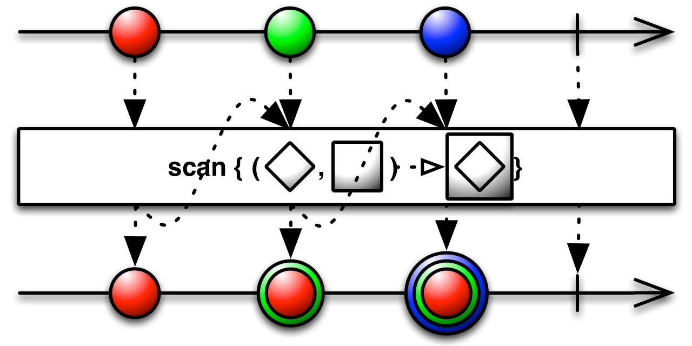

# Transforming Observables

## Buffer
Buffer操作符所要做的事情就是将数据安装规定的大小做一下缓存，然后将缓存的数据作为一个集合发射出去.

## FlatMap
FlatMap是一个用处多多的操作符，可以将要数据根据你想要的规则进行转化后再发射出去。其原理就是将这个Observable转化为多个以原Observable发射的数据作为源数据的Observable，然后再将这多个Observable发射的数据整合发射出来，需要注意的是最后的顺序可能会交错地发射出来，如果对顺序有严格的要求的话可以使用concatmap操作符。FlatMapIterable和FlatMap基本相同，不同之处为其转化的多个Observable是使用Iterable作为源数据的。
```java
private Observable<String> flatMapObserver() {
    return Observable.just(1, 2, 3, 4, 5, 6, 7, 8, 9)
        .flatMap(integer -> Observable.just("flat map:" + integer));
}

private Observable<? extends Integer> flatMapIterableObserver() {
    return Observable.just(1, 2, 3, 4, 5, 6, 7, 8, 9)
            .flatMapIterable(
                    integer -> {
                        ArrayList<Integer> s = new ArrayList<>();
                        for (int i = 0; i < integer; i++) {
                            s.add(integer);
                        }
                        return s;
                    }
            );
}

mLButton.setText("flatMap");
mLButton.setOnClickListener(e -> flatMapObserver().subscribe(i -> log(i)));
mRButton.setText("flatMapIterable");
mRButton.setOnClickListener(e -> flatMapIterableObserver().subscribe(i -> log("flatMapIterable:" + i)));
```

## GroupBy
GroupBy操作符将原始Observable发射的数据按照key来拆分成一些小的Observable，然后这些小的Observable分别发射其所包含的的数据，类似于sql里面的groupBy。
在使用中，我们需要提供一个生成key的规则，所有key相同的数据会包含在同一个小的Observable种。另外我们还可以提供一个函数来对这些数据进行转化，有点类似于集成了flatMap。
```java
mLButton.setText("groupBy");
mLButton.setOnClickListener(
    e -> groupByObserver().subscribe(new Subscriber<GroupedObservable<Integer, Integer>>() {
        @Override
        public void onCompleted() {

        }

        @Override
        public void onError(Throwable e) {

        }

        @Override
        public void onNext(GroupedObservable<Integer, Integer> groupedObservable) {
            groupedObservable.count()
            .subscribe(integer -> 
            log("key" + groupedObservable.getKey() + " contains:" + integer + " numbers"));
        }
}));

mRButton.setText("groupByKeyValue");
mRButton.setOnClickListener(e -> groupByKeyValueObserver()
    .subscribe(new Subscriber<GroupedObservable<Integer, String>>() {
        @Override
        public void onCompleted() {

        }

        @Override
        public void onError(Throwable e) {

        }

        @Override
        public void onNext(GroupedObservable<Integer, String> integerIntegerGroupedObservable) {
            if (integerIntegerGroupedObservable.getKey() == 0) {
                integerIntegerGroupedObservable.subscribe(integer -> log(integer));
            }
        }
    }));


private Observable<GroupedObservable<Integer, Integer>> groupByObserver() {
    return Observable.just(1, 2, 3, 4, 5, 6, 7, 8, 9).groupBy(integer -> integer % 2);
}

private Observable<GroupedObservable<Integer, String>> groupByKeyValueObserver() {
    return Observable.just(1, 2, 3, 4, 5, 6, 7, 8, 9)
            .groupBy(integer -> integer % 2, integer -> "groupByKeyValue:" + integer);
}
```

## Map、Cast
Map操作符的功能类似于FlatMap，不同之处在于它对数据的转化是直接进行的，而FlatMap需要通过一些中间的Observables来进行。
<div align=center>

</div>

Cast将Observable发射的数据强制转化为另外一种类型，属于Map的一种具体的实现
<div align=center>

</div>

## Scan
Scan操作符对一个序列的数据应用一个函数，并将这个函数的结果发射出去作为下个数据应用这个函数时候的第一个参数使用，有点类似于递归操作
<div align=center>

</div>

```java
private Observable<Integer> scanObserver() {
    return Observable.from(list).scan((x, y) -> x * y).observeOn(AndroidSchedulers.mainThread());
}
mLButton.setText("scan");
mLButton.setOnClickListener(e -> scanObserver().subscribe(i -> log("scan:" + i)));
```

## Window
Window操作符类似于我们前面讲过的buffer，不同之处在于window发射的是一些小的Observable对象，由这些小的Observable对象来发射内部包含的数据。同buffer一样，window不仅可以通过数目来分组还可以通过时间等规则来分组

<div align=center>

</div>

```java
private Observable<Observable<Integer>> windowCountObserver() {
    return Observable.just(1, 2, 3, 4, 5, 6, 7, 8, 9).window(3);
}

private Observable<Observable<Long>> wondowTimeObserver() {
    return Observable.interval(1000, TimeUnit.MILLISECONDS)
        .window(3000, TimeUnit.MILLISECONDS)
        .observeOn(AndroidSchedulers.mainThread());
}

mLButton.setText("window");
mLButton.setOnClickListener(e -> windowCountObserver().subscribe(i -> {
    log(i);
    i.subscribe((j -> log("window:" + j)));
}));
mRButton.setText("Time");
mRButton.setOnClickListener(e -> wondowTimeObserver().subscribe(i -> {
    log(i);
    i.observeOn(AndroidSchedulers.mainThread()).subscribe((j -> log("wondowTime:" + j)));
}));
```

# Filtering
