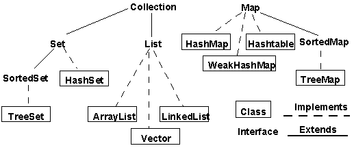

<div align=center>

</div>

# List、Set和Queue
在Collection这个集成链中，我们介绍List、Set和Queue。其中会重点介绍List和Set以及几个常用实现class。

先简单概述下List和Set。他们2个是继承Collection的子接口，就是说他们也都是负责存储单个元素的容器。但是最大的区别如下

* List是存储的元素容器是有个有序的可以索引到元素的容器，并且里面的元素可以重复。

* Set里面和List最大的区别是Set里面的元素对象不可重复。

|Set实现|使用场景|数据结构|
|------|-------|-------|
|HashSet|无序的、无重复的数据结构|基于HashMap|
|LinkedSet|维护次序的HashSet|基于LinkedHashMap|
|TreeSet|保持元素大小次序的集合，元素需要实现Comparable接口|基于TreeMap|

## HashMap

HashMap的存储定义：

```java
    static class Node<K,V> implements Map.Entry<K,V> {
        final int hash;
        final K key;
        V value;
        Node<K,V> next;

        Node(int hash, K key, V value, Node<K,V> next) {
            this.hash = hash;
            this.key = key;
            this.value = value;
            this.next = next;
        }

        public final K getKey()        { return key; }
        public final V getValue()      { return value; }
        public final String toString() { return key + "=" + value; }

        public final int hashCode() {
            return Objects.hashCode(key) ^ Objects.hashCode(value);
        }

        public final V setValue(V newValue) {
            V oldValue = value;
            value = newValue;
            return oldValue;
        }

        public final boolean equals(Object o) {
            if (o == this)
                return true;
            if (o instanceof Map.Entry) {
                Map.Entry<?,?> e = (Map.Entry<?,?>)o;
                if (Objects.equals(key, e.getKey()) &&
                    Objects.equals(value, e.getValue()))
                    return true;
            }
            return false;
        }
    }
```

get核心方法：
```java
    final Node<K,V> getNode(int hash, Object key) {
        Node<K,V>[] tab; Node<K,V> first, e; int n; K k;
        if ((tab = table) != null && (n = tab.length) > 0 &&
            (first = tab[(n - 1) & hash]) != null) {
            if (first.hash == hash && // always check first node
                ((k = first.key) == key || (key != null && key.equals(k))))
                return first;
            if ((e = first.next) != null) {
                if (first instanceof TreeNode)
                    return ((TreeNode<K,V>)first).getTreeNode(hash, key);
                do {
                    if (e.hash == hash &&
                        ((k = e.key) == key || (key != null && key.equals(k))))
                        return e;
                } while ((e = e.next) != null);
            }
        }
        return null;
    }
```
上面代码中看出先根据hash值和数组长度作且运算得出下标索引。如果存在判断hash值是否完全一致，如果不完全一致则next链表向下找一致的hash值。

核心put方法：
```java
    final V putVal(int hash, K key, V value, boolean onlyIfAbsent,
                   boolean evict) {
        Node<K,V>[] tab; Node<K,V> p; int n, i;
        if ((tab = table) == null || (n = tab.length) == 0)
            n = (tab = resize()).length;
        if ((p = tab[i = (n - 1) & hash]) == null)
            tab[i] = newNode(hash, key, value, null);
        else {
            Node<K,V> e; K k;
            if (p.hash == hash &&
                ((k = p.key) == key || (key != null && key.equals(k))))
                e = p;
            else if (p instanceof TreeNode)
                e = ((TreeNode<K,V>)p).putTreeVal(this, tab, hash, key, value);
            else {
                for (int binCount = 0; ; ++binCount) {
                    if ((e = p.next) == null) {
                        p.next = newNode(hash, key, value, null);
                        if (binCount >= TREEIFY_THRESHOLD - 1) // -1 for 1st
                            treeifyBin(tab, hash);
                        break;
                    }
                    if (e.hash == hash &&
                        ((k = e.key) == key || (key != null && key.equals(k))))
                        break;
                    p = e;
                }
            }
            if (e != null) { // existing mapping for key
                V oldValue = e.value;
                if (!onlyIfAbsent || oldValue == null)
                    e.value = value;
                afterNodeAccess(e);
                return oldValue;
            }
        }
        ++modCount;
        if (++size > threshold)
            resize();
        afterNodeInsertion(evict);
        return null;
    }
```

上面是put的核心源码，即查找hash值所在索引是否有元素，没有的话new一个Node直接放在table中。如果已经有Node了，就遍历该Node的next，将新元素放到最后。

HashMap的遍历，是从数组遍历第一个非空的元素，然后再根据这个元素访问其next下的所有Node。因为第一个元素不是一定从数组的0开始，所以HashMap是无序遍历。

## LinkedHashMap

LinkedHashMap相对于HashMap来说区别是，LinkedHashMap遍历的时候具有顺序，可以保存插入的顺序，（还可以设置最近访问的元素也放在前面，即LRU）

其实LinkedHashMap的存储还是跟HashMap一样，采用哈希表方法存储，只不过LinkedHashMap多维护了一份head，tail链表。

|Map实现|使用场景|数据结构|
|------|-------|-------|
|HashMap|哈希表存储键值对，key不重复，无序|哈希散列表|
|LinkedHashMap|是一个可以记录插入顺序和访问顺序的HashMap|存储方式是哈希散列表，但是维护了头尾指针用来记录顺序|
|TreeMap|具有元素排序功能|红黑树|
|WeakHashMap|弱键映射，映射之外无引用的键，可以被垃圾回收|哈希散列表|


# 并发容器
线程安全的队列有两种方式：
* 使用阻塞算法。入队和出队分别用锁实现。
* 使用非阻塞算法。ConcurrentLinkedQueue就使用非阻塞算法。

JDK7提供了7个阻塞队列
* ArrayBlockingQueue：一个数组结构组成的有界阻塞队列， 不保证线程公平的访问队列。
* LinkedBlockingQueue：一个链表结构组成的有界阻塞队列, 默认和最大长度为Integer.MAX_VALUE。
* PriorityBlockingQueue：一个支持优先级排序的无界阻塞队列。

可以自定义类实现compareTo()，也可是初始化的时候通过参数Comparator来对元素进行排序。

* DelayQueue：一个使用优先级队列实现的无界阻塞队列。

支持延时获取元素的无界阻塞队列。
队列中的元素必须实现Delayed接口，在创建元素时可以指定多久才能从队列中获取当前元素，只有在延迟期满时才能从队列中提取元素。

* SynchronousQueue：一个不存储元素的阻塞队列。

一个不存储元素的阻塞队列，每一个put操作必须等待一个take操作，否则不能继续添加元素。SynchronousQueue可以看做一个传球手，把生产者的数据直接传递给消费者。

* LinkedTransferQueue：一个链表结构组成的无界阻塞队列。

新特性:

1. transfer：若当前存在一个正在等待获取的消费者线程，即立刻移交之；否则，会插入当前元素e到队列尾部，并阻塞到该元素被消费者消费之后返回。
2. tryTransfer(E e)：若当前存在一个正在等待获取的消费者线程（使用take()或者poll()函数），使用该方法会即刻转移/传输对象元素e；若不存在，则返回false，并且不进入队列。这是一个不阻塞的操作。
3. tryTransfer(E e,long timeout, TimeUnit unit)：试图把生产者传入的元素直接传给消费者，如果没有消费者消费该元素则等待指定时间再返回，返回false，同时该元素被移除。如果在超过时间内消费了该元素，那么返回true。

* LinkedBlockingDeque：一个链表结构组成的双向阻塞队列。